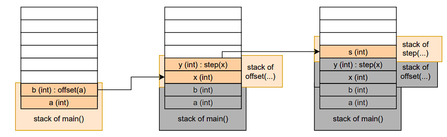
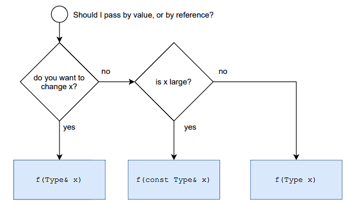

- [1 Functions calls and the call stack](#1-functions-calls-and-the-call-stack)
  - [1.1 A simple function](#11-a-simple-function)
  - [1.2 Call-stack example](#12-call-stack-example)
- [2 Call-by-value and call-by-reference](#2-call-by-value-and-call-by-reference)
  - [2.1 Pass by value -vs- pass by reference](#21-pass-by-value--vs--pass-by-reference)
  - [2.2  Pass by const reference](#22--pass-by-const-reference)
- [3. Function overloading and function templates (basics)](#3-function-overloading-and-function-templates-basics)
  - [3.1 Function overloading](#31-function-overloading)
  - [3.2 Default arguments](#32-default-arguments)
  - [3.3 "Overloading" with Templates](#33-overloading-with-templates)
- [4 Anonymous functions (lambda expressions)](#4-anonymous-functions-lambda-expressions)
  - [4.1 Anonymous functions: syntax](#41-anonymous-functions-syntax)
  - [4.2 Passing functions to... functions](#42-passing-functions-to-functions)
- [5 Error handling with exceptions](#5-error-handling-with-exceptions)
- [6 Recursion](#6-recursion)
  - [6.1 Recursive functions](#61-recursive-functions)
  - [6.2 Tail recursion](#62-tail-recursion)

## 1 Functions calls and the call stack

### 1.1 A simple function

```C++
int offset(int);        // Declaration of the function (optional)
                        // with signature offset(int).
                        // Name in the binary by GCC: _Z6offseti

int offset(int x){      // Definition of the function
    int y = x + 40;     // Body of the function
    return y;           // Return the value of y as int
}

int main(){
    int a = 2;
    int b = offset(a);  // Calling the function
    return 0;           // Default in C++
}
```

### 1.2 Call-stack example

```C++
int step(int s){
    return s*s;
}

int offset(int x){
    int y = x + step(x);
    return y;
}

int main(){
    int a = 2;
    int b = offset(a);
    std::cout << "a=" << a << " b=" << b << std::endl;
}
```



After compution `s`: the stack is unrolled.


## 2 Call-by-value and call-by-reference

### 2.1 Pass by value -vs- pass by reference

- Pass by value: copies the passed argument into the function.<br>
→ the original stays untouched, but copying can be expensive.

- Pass by reference: shares the passed argument with the function.<br>
→ no copy overhead, but the function may (unintentionally) modify the original.

```C++
int offset(int x){
    int y = x + 40;
    return y;
}

int main(){
    int a = 2;
    int b = offset(a);
    std::cout << a << b << "\n";
}
```

```C++
void offset(int& x){
    x = x + 40;
    return;
}

int main(){
    int a = 2;
    offset(a);
    std::cout << a << "\n";
}
```

### 2.2  Pass by const reference

- Pass by const reference: shares the passed argument with the function, in a read-only fashion.<br>
→ no copy overhead and the function cannot modify the original.

```C++
void offset(const int& x){ // or, equivalent: int& const x
    x = x + 40; // Error: x is not allowed to be modified
    return;
}
```

**Which one should I choose?**


For more details, read the [F.call Core Guidelines](https://isocpp.github.io/CppCoreGuidelines/CppCoreGuidelines#fcall-parameter-passing).

**Can we also return by reference?**

```C++
int& offset(int x){
    int y = x + 40;
    return y;
}
// ...
int b = offset(a);
```

```bash
<source>: In function 'int& offset(int)':
<source>:5:12: warning: reference to local variable 'y' returned
```

**Can we return `x` by reference?**
- Not either: arguments are also on the stack.
- We will come back to this in [Object-Oriented Programming](5.%20OOP.html).

**Can we return multiple values?**

```C++
std::pair<int,int> offset(int x){
    int step = 40; // Assume step changes over time.
    int y = x + step;

    return std::pair<int,int> (y, step);
// return std::pair (y, step); // Since C++17
}

int main(){
    int a = 2;
    auto [b, s] = offset(a); // A "structured binding",
                            // binding b and s to the pair.

    std::cout << "a=" << a << " b=" << b << " s=" << s << "\n";
}
```

## 3. Function overloading and function templates (basics)

### 3.1 Function overloading

```C++
int offset(int x){      // Name in the binary: _Z6offseti
    int y = x + 40;     // or, demangled: offset(int)
    return y;
}

double offset(double x){ // Name in the binary: _Z6offsetd
    double y = x + 40.0; // or, demangled: offset(double)
    return y;
}

int main(){
    auto b1 = offset(2);
    auto b2 = offset(0.01);
}
```

**Which function is called when execution?**<br>
- `double a = 1.23; offset_ref(a);`?
  1. `void offset_ref(double& x)` $\leftarrow$
  2. `void offset_ref(const double& x)`<br>
What if we called `offset_ref(1.23)`?

- `auto r = offset_by_step(1.0, 0.1);`?
  1. `double offset_by_step(double x, int y)`
  2. `double offset_by_step(int x, double y)`<br>
$\to$ Does not compile: ambiguous.

### 3.2 Default arguments

```C++
int offset(int x, int step=40){
    return x + step;
}

int main(){
    int a = 2;
    int b = offset(a);
    int c = offset(a, 254);

    std::cout << "a=" << a << " b=" << b << " c=" << c << std::endl;
}
```

- Default arguments must come after all the non-default arguments.
- They must not interfere with overloaded functions.

### 3.3 "Overloading" with Templates

```C++
template <typename T>
T offset(T x){
    return x + static_cast<T>(40);
}

int main(){
    int b1 = offset<int>(2);
    double b2 = offset<double>(0.01);
    double b3 = offset(3.14); // equivalent: automatic type deduction

    std::cout << " b1=" << b1 << " b2=" << b2
              << " b3=" << b3 << "\n";
}
```

Function templates **describe** functions, they are not functions.

See also later lecture [Templates](6.%20Templates.html).

## 4 Anonymous functions (lambda expressions)

```C++
void apply_bonus(double& grade){
    if (grade <= 4.0 && grade > 1.0) {
        grade = offset(grade, -0.3);
    }
}

int main(){
    std::vector<double> grades {1.3, 2.7, 4.3, 2.0};

    // Manually iterating over all grades and calling apply_bonus
    for (auto& grade : grades) {
        apply_bonus(grade);
    }
}
```

$\to$

```C++
void apply_bonus(double& grade){
    if (grade <= 4.0 && grade > 1.0) {
        grade = offset(grade, -0.3);
    }
}

int main(){
    std::vector<double> grades {1.3, 2.7, 4.3, 2.0};

    // Call apply_bonus on every element of grades
    std::for_each( grades.begin(), grades.end(), apply_bonus);
}
```

$\to$ How to rewrite it in lambda expressions

```C++
//
// (no named function apply_bonus)
//
//
//

int main(){
    std::vector<double> grades {1.3, 2.7, 4.3, 2.0};

    // Apply an anonymous function on every element of grades
    std::for_each( grades.begin(), grades.end(),
        [](double& grade){ if (grade <= 4.0 && grade > 1.0) {
                            grade = offset(grade, -0.3);
                        } } );
}
```

### 4.1 Anonymous functions: syntax

General syntax: `[ captured_state ]( arguments ){ body }`<br>
- `captured_state`: 
  1. Captured all by value: [=],
  2. Captured all by reference: [&],
  3. Capture none: [].
- `Arguments` and `body`: exactly the same as in normal functions.

### 4.2 Passing functions to... functions

```C++
void apply_bonus(double& grade,
                std::function<double(double, double)> operation){
            // std::function< return_type (argument_types) >
    grade = operation(grade, -0.3);
}

int main(){
    std::vector<double> grades {1.3, 2.7, 4.3, 2.0};
    auto super_bonus = [](double x, double step){return x + 3*step;};

    for (auto& grade : grades) {
        apply_bonus(grade, offset);
        apply_bonus(grade, super_bonus);
    }
}
```

## 5 Error handling with exceptions

```C++
void apply_bonus(double& grade){
    if (grade < 1.0 || grade > 5.0) {
        throw(std::invalid_argument("Invalid grade"));
    } // ...
}

std::vector<double> grades {1.3, 5.7, 4.3, 2.0};
for (auto& grade : grades) {
    try{
        apply_bonus(grade);
    }
    catch(const std::invalid_argument& error){
        std::cerr << "Warning: " << error.what() << "\n";
    }
}
```

Guideline: Throw an exception to signal that a function can't perform its assigned task (not for any kind of error message).

Hierarchy of `standard expection types` (use the most specific):
- `std::exception`
    - `std::logic_error`
        - `std::invalid_argument`
        - `std::out_of_range`
    - `std::runtime_error`
    - `...`

## 6 Recursion

We can expand a factorial *N*! like this:
$$
    N! = (N-1)!\cdot N
$$
This means, in code: `factorial(N) = factorial(N-1) * N`<br>
which needs to first compute: `factorial(N-1) = factorial(N-2) * (N-1)`<br>
until the base case: `factorial(1) = 1`
### 6.1 Recursive functions

```C++
unsigned int factorial(unsigned int n){
    if (n <= 1) {
        return 1;
    } else {
        return factorial(n-1) * n; // function call + multiplication
    }
}

std::cout << factorial(3) << "\n";
```

### 6.2 Tail recursion

```C++
unsigned int factorial(unsigned int n, unsigned int val = 1){
    if (n <= 1) {
        return val;
    } else {
        return factorial(n-1, val * n); // only function call
    }
}

std::cout << factorial(3) << "\n";
```
