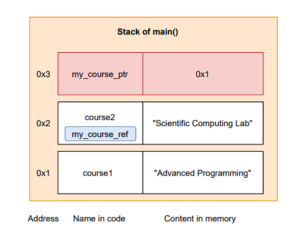
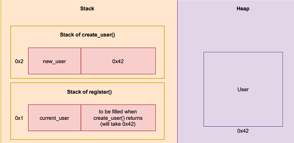
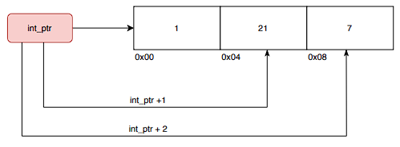

- [1 References vs pointers (raw `&` smart)](#1-references-vs-pointers-raw--smart)
  - [1.1 Repetition: Call-by-value vs. Call-by-reference](#11-repetition-call-by-value-vs-call-by-reference)
  - [1.2 Choosing an address at runtime: pointers](#12-choosing-an-address-at-runtime-pointers)
  - [1.3 A mental model (references `&` pointers)](#13-a-mental-model-references--pointers)
  - [1.4 References vs pointers in memory](#14-references-vs-pointers-in-memory)
- [2 Managing dynamically allocated memory](#2-managing-dynamically-allocated-memory)
  - [2.1 Aquiring a resource](#21-aquiring-a-resource)
  - [2.2 A mental model (stack `&` heap)](#22-a-mental-model-stack--heap)
  - [2.3 Could we return by reference?](#23-could-we-return-by-reference)
  - [2.4 Heap Segment Administration](#24-heap-segment-administration)
- [3 Memory leaks](#3-memory-leaks)
  - [3.1 Avoiding memory leaks: Smart pointers](#31-avoiding-memory-leaks-smart-pointers)
  - [3.2 Common types of smart pointers](#32-common-types-of-smart-pointers)
- [4 Memory-managing containers](#4-memory-managing-containers)
  - [4.1 Repetition: arrays `&` vectors](#41-repetition-arrays--vectors)
  - [4.2 Before `std::array`: C-style arrays (legacy)](#42-before-stdarray-c-style-arrays-legacy)
  - [4.3 Before `std::vector`: dynamic arrays (legacy)](#43-before-stdvector-dynamic-arrays-legacy)
  - [4.4 Under-the-hood: pointer arithmetic](#44-under-the-hood-pointer-arithmetic)
- [5 Iterators](#5-iterators)
  - [5.1 Pointer arithmetic](#51-pointer-arithmetic)
  - [5.2 Iterators example](#52-iterators-example)
  - [5.3 STL Algorithms work with iterators](#53-stl-algorithms-work-with-iterators)
  - [5.4 Passing vectors to legacy functions](#54-passing-vectors-to-legacy-functions)
- [6 lvalue `&` rvalue references](#6-lvalue--rvalue-references)
  - [6.1 What is an lvalue and an rvalue?](#61-what-is-an-lvalue-and-an-rvalue)
  - [6.2 lvalue references: an example](#62-lvalue-references-an-example)
  - [6.3 rvalue references](#63-rvalue-references)
  - [6.4 When do we use `&&` (rvalue references)?](#64-when-do-we-use--rvalue-references)

## 1 References vs pointers (raw `&` smart)

### 1.1 Repetition: Call-by-value vs. Call-by-reference

```cpp
void amplify(int& b) {
    b = 100*b;
    std::cout << "Value of b: " << b << "\n";
}

int a = 20;
amplify(a);
std::cout << "Value of a: " << a << "\n";
```

**What is a reference?**

```cpp
int x = 10;

int& ref_to_x = x; // ref_to_x is also 10.

x = x + 1; // increment x.

std::cout << ref_to_x << "\n"; // ref_to_x is also 11.
```

**Important**
A reference must be initialized at compile-time!

**We cannot initialize a reference at runtime**

Selecting a course at compile-time works:

```cpp
std::string course1 = "Advanced Programming";
std::string course2 = "Scientific Computing Lab";

std::string& my_course_ref = course2;

std::cout << "Registering for " << my_course_ref << "\n";
```

### 1.2 Choosing an address at runtime: pointers

```cpp
std::string course1 = "Advanced Programming";
std::string course2 = "Scientific Computing Lab";
std::string* my_course_ptr;

std::cin >> menu_selection;
if (menu_selection == "1")
    my_course_ptr = &course1;
else
    my_course_ptr = &course2;

std::cout << "Registering for " << *my_course_ptr << "\n";
```

- A pointer is a type that stores an address
- We can modify it at runtime
- To access the content of that address, we need to **dereference** it

### 1.3 A mental model (references `&` pointers)



### 1.4 References vs pointers in memory

```cpp
int a = 5;
int & b = a;
int * c = &a;

std::cout << "a = " << a << ", &a = " << &a << "\n";
std::cout << "b = " << b << ", &b = " << &b << "\n";
std::cout << "c = " << c << ", &c = " << &c 
                          << ", *c = " << *c << "\n";
```

Output
```cpp
a = 5, &a = 0x7ffcdafe0f64
b = 5, &b = 0x7ffcdafe0f64
c = 0x7ffcdafe0f64, &c = 0x7ffcdafe0f58, *c = 5
```

## 2 Managing dynamically allocated memory

### 2.1 Aquiring a resource

**An unsage way to reserve memory in the heap**

```cpp
User* create_user(std::string name){
    User* new_user; // On the stack of create_user
    new_user = new User(name); // On the heap
    return new_user;
}

void register_student(std::string name){
    User* current_user = create_user(name); // ...
    copy user and data to a database
    delete current_user;
}

register_student("Lebowski");
```

- We want that the new user stays in memory after `create_user` returns.
- We need to (remember to) `delete` the `new` resource afterwards.

### 2.2 A mental model (stack `&` heap)



### 2.3 Could we return by reference?

```cpp
User & create_user(std::string name){
    User new_user(name); // On the stack of create_user
    return new_user;
}

void register_student(std::string name){
    User current_user = create_user(name); // ...
    copy user and data to a database
}

register_student("Lebowski");
```

No: the returned address would not exist anymore (however, compiles with warning).<br>
This may give a segmentation fault: we access a memory segment that we are not allowed to - even worse, it may run silently

### 2.4 Heap Segment Administration

- On stack: mapping of (new) variables onto memory locations<br>
  → deterministic and consecutive
- On heap: no such mapping possible
  → size of reserved data unknown at compile time

The system has to administer the heap segment:
- find place for new variables
- free/reuse unused memory
    - Java: automatic garbage collection
    - C++: clean-up after yourself (or use types that do not litter)

## 3 Memory leaks

```cpp
User* create_user(std::string name){
    User* new_user;             // On the stack of create_user
    new_user = new User(name);  // On the heap
    return new_user;
}

void register_group(){
    User * current_user;
    for(auto i=0; i<3; i++){
        std::cin >> name;
        current_user = create_user(name); // ... copy user and data to a database
    }
    delete current_user;
}
```

Do we delete all the new temporary objects correctly?<br>
No: We only delete the last one.

### 3.1 Avoiding memory leaks: Smart pointers

Smart pointers automatically delete the memory they point to when they are not being used anymore (via their destructor).

```cpp
std::unique_ptr<User> create_user(std::string name){
    std::unique_ptr<User> new_user;
    new_user = std::make_unique<User>(name);
    return new_user;
}

void register_student(std::string name){
    std::unique_ptr<User> current_user = create_user(name); // ... copy user and data to a database
}
```

### 3.2 Common types of smart pointers

**Unique pointer**
- Type: `std::unique_ptr<>`
- Creation: `std::make_unique<>()`
- Only one pointer to the underlying memory allowed.
- I know I am the only one using this resource, I can safely release it.
- Use case: Unique pointer to a file.
- 
**Shared pointer**
- Type: `std::shared_ptr<>`
- Creation: `std::make_shared<>()`
- Shared ownership: multiple pointers to the object allowed (overhead).
- The object is only deleted if there are no more pointers to it.
- Use case: A list of courses, resources shared by multiple threads.

Additional difference between `unique_ptr` and `shared_ptr`:<br>
- A `unique_ptr` cannot be copied, only moved<br>
→ ensure one unique pointer to a dynamically allocated resource.
- A `shared_ptr` can be copied<br>
→ the resource will be destroyed when the last pointer to it is destroyed.


## 4 Memory-managing containers

### 4.1 Repetition: arrays `&` vectors

- `std::array<int,3> my_array = {10, 20, 30}; // Elements on stack`
- `std::vector<int> my_vector = {10, 20, 30}; // Elements on heap`

Similar goal as smart pointers: **RAII (Resource Acquisition Is Initialization)**<br>
$\to$ If an object allocates memory on the heap, it is the same object that has to delete it (and not us).

### 4.2 Before `std::array`: C-style arrays (legacy)

**Statically allocated, fixed size**

```cpp
const size_t arr_size = 3;
int arr[arr_size] = {1,2,3}; // fixed size

// iterate over entries and double them
for(int i = 0; i < arr_size; i++ ){
    arr[i] += arr[i];
}
```

### 4.3 Before `std::vector`: dynamic arrays (legacy)

**Dynamically allocated, fixed size**

```cpp
int size = 1000;
int* arr_heap = new int[size];
for(int i = 0; i < size; i++){
    arr_heap[i] = 2 * i;
}
delete[] arr_heap; // delete array
```

- The array still has fixed size.
- The pointer `arr_heap` owns memory on the heap.
- Memory leak: destructing a pointer that owns heap memory without calling `delete` or `delete[]` on it.
- To add more elements: allocate larger memory block, copy current data, release current memory.

### 4.4 Under-the-hood: pointer arithmetic

```cpp
int i_arr[3] = {1,21,7};
int* int_ptr = i_arr; // i_arr decays to pointer
std::cout << int_ptr[2] << " " << *(int_ptr + 2) << "\n";

// The same also works for arrays:
std::cout << i_arr[2] << " " << *(i_arr + 2) << "\n";
```



## 5 Iterators

### 5.1 Pointer arithmetic
Pointer arithmetic: address + N → address to the N-th element in an array.

Iterators: general way to traverse over any C++ container (e.g., std::vector). One can view them as a generalization of pointers.

Operations:
- `++`: yield an iterator that refers to the next element.
- `*`: yield the element to which the iterator refers.
- `.begin()`: iterator to the beginning of the container.
- `.end()`: iterator to one-past-the-last element of the container.

### 5.2 Iterators example

```cpp
std::vector<int> myvec = {10, 20, 30};

for ( int i = 0; i < myvec.size(); ++i ){
    std::cout << myvec[i];
}

for ( auto iter = myvec.begin(); iter != myvec.end(); ++iter ){
    std::cout << *iter;
}
```

We don’t need to use this explicitly most of the time: ranged-for loop implements this mechanism under-the-hood.<br>
Iterators also work with non-contiguous containers: `std::list`, `std::map`, ...

### 5.3 STL Algorithms work with iterators

```cpp
std::vector<int> myvec = {95, 98, 2000, 10, 11};

std::sort(myvec.begin(), myvec.end());

for (const auto & elem : myvec){
    std::cout << elem;
}

// Output: 10, 11, 95, 98, 2000
```

### 5.4 Passing vectors to legacy functions

```cpp
// An old C++ or C function, usually from a library
void transform(int * data, size_t size){
    for (size_t i = 0; i < size; i++){
        data[i] = 2*data[i]; // some transformation
    }
}

int main(){
    std::vector<int> my_data = {10, 20, 30};
    transform( my_data.data(), my_data.size() );
}
```

Similar methods exist for more containers (such as std::array).

**When to actually use raw pointers?**

- When we offer a library compatible with older C++ and C.
- When we need to interact with memory/hardware at a low level (e.g., passing/getting a pointer to/from hardware in embedded systems). 

Avoid creating **owning raw pointers**: <br>
pointers that point to memory dynamically allocated using new.

## 6 lvalue `&` rvalue references

### 6.1 What is an lvalue and an rvalue?

Consider an assignment:
$$
b = a + 1
$$
- b is on the left of =.
    - It is a name for a memory location.
    - We can store values into it.
    - b is an **lvalue**.

- a + 1 can only appear on the right of =.
    - It does not have a name, there is no named location reserved for it.
    - We can only store it into a location with a name.
    - a + 1 is an **rvalue**. 

In other words: the result of adding a to 1 is a temporary value. Without assigning to b, i.e., giving it a memory location to live in, it would have just been destroyed.

### 6.2 lvalue references: an example

```cpp
void f1(int& x){
    std::cout << x;
}

void f2(const int& y){
    std::cout << y;
}

int main() {
    int a = 4;
    int b = a+1; // lvalue = rvalue
    f1(b); // compiles: x is another name for b
    f1(a+1); // does not compile: a+1 is not stored in a variable
    f2(a+1); // compiles (const lvalue references to rvalues allowed)
}
```

### 6.3 rvalue references

```cpp
void f3(int&& z){
    std::cout << z;
}

int main() {
    int a = 4;
    int b = a+1; // lvalue = rvalue
    f3(a+1); // compiles: && is an rvalue reference
    f3(b); // does not compile: b is an lvalue, // while z is an rvalue reference
}
```

### 6.4 When do we use `&&` (rvalue references)?

**Copying vs moving**

Copying an object with dynamically allocated memory usually means a deep copy: copy everything including dynamically allocated data.

For temporary objects (rvalues), we may not want to perform a deep copy: we can “steal” their dynamic resources instead.

For example, `vector.push_back(some_element)` offers at least:

```cpp
void push_back(const T& value );
void push_back(T&& value );
```

1. The first variant initializes a new element as a copy of value.
2. The second variant moves value into the new element: copies the underlying pointer and invalidates the original pointer. We will come back to this in [Object-Oriented Programming](5.%20OOP.html).

