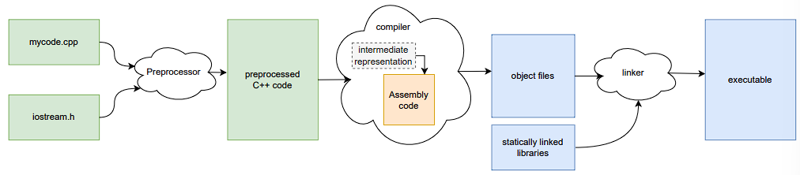
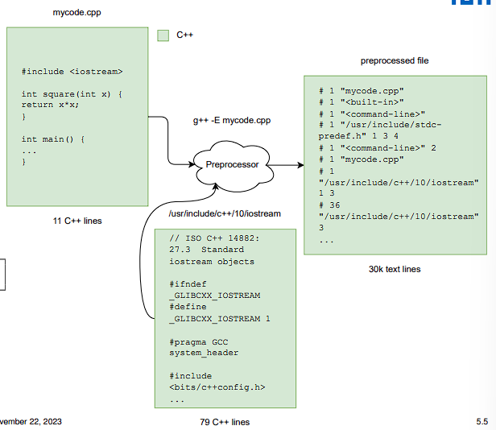
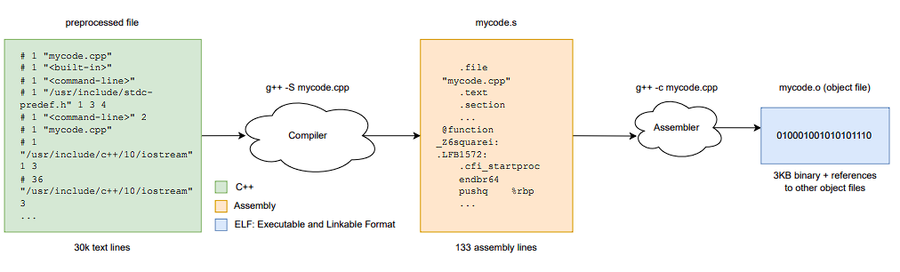
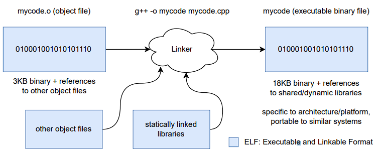
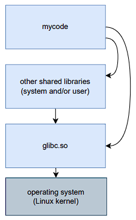
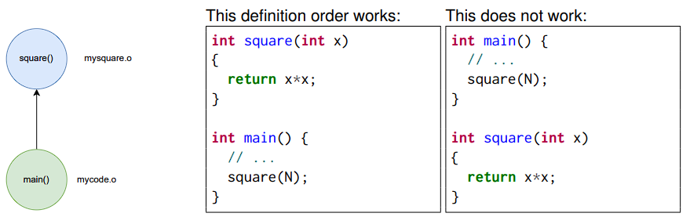
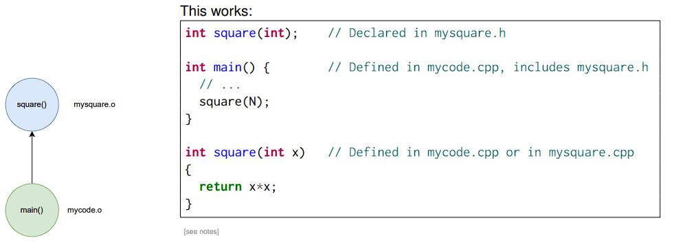
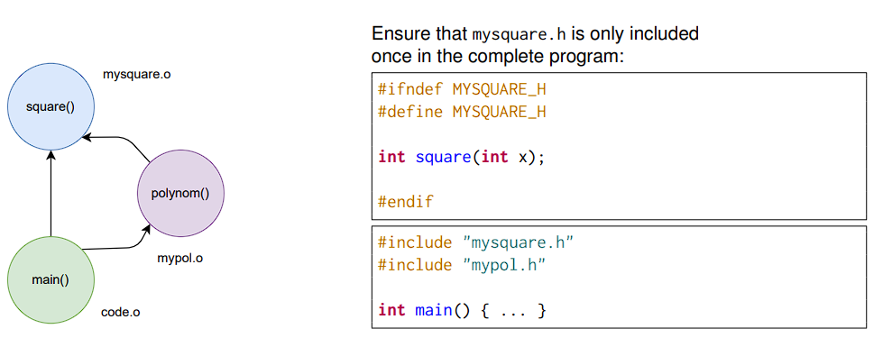

- [1. Build folw: preprocessor, compiler, linker, runtime](#1-build-folw-preprocessor-compiler-linker-runtime)
  - [1.1 Demystifying compilation](#11-demystifying-compilation)
  - [1.2 Overview of building flow](#12-overview-of-building-flow)
  - [1.3 Preprocessor](#13-preprocessor)
  - [1.4 Compiler](#14-compiler)
  - [1.5 Linker](#15-linker)
  - [1.6 What do these binaries contain?](#16-what-do-these-binaries-contain)
  - [1.7 Are the binaries portable?](#17-are-the-binaries-portable)
  - [1.8 Runtime linking](#18-runtime-linking)
  - [1.9 Do I need to recompile?](#19-do-i-need-to-recompile)
- [2. Organizing our code: header files, modules](#2-organizing-our-code-header-files-modules)
  - [2.1 Organizing our code into separate files.](#21-organizing-our-code-into-separate-files)
  - [2.2 Header \& implementation files](#22-header--implementation-files)
  - [2.3 Order of inclusion matters](#23-order-of-inclusion-matters)
  - [2.4 Include guards](#24-include-guards)
  - [2.5 A glimpse into the future of C++: Modules](#25-a-glimpse-into-the-future-of-c-modules)
- [3 Compile-time computation](#3-compile-time-computation)
  - [3.1 Constant expressions: `constexpr`](#31-constant-expressions-constexpr)
  - [3.2 constexpr variables](#32-constexpr-variables)
  - [3.3 constexpr functions](#33-constexpr-functions)
- [4 Build systems, build configuration systems, distributing software](#4-build-systems-build-configuration-systems-distributing-software)
  - [4.1 Build systems](#41-build-systems)
  - [4.2 Build systems: Make](#42-build-systems-make)
  - [4.3 Build configuration systems](#43-build-configuration-systems)
  - [4.4 Distributing software](#44-distributing-software)

## 1. Build folw: preprocessor, compiler, linker, runtime

### 1.1 Demystifying compilation

Consider a file `mycode.cpp`:

```cpp
#include <iostream>

int square(int x) {
    return x * x;
}

int main() {
    auto N = 5;
    std::cout << square(N) << "\n";
    return 0;
}
```

With GCC on Linux, we compile it like this:
```bash
g++ -o mycode mycode.cpp
```

### 1.2 Overview of building flow



- Different programs/tools at each step (invoked by g++). 
- Every step is a research field on its own.

For more details, see:
[CppCon 2019: Peter Bindels & Sy Brand “Hello World From Scratch”](https://www.youtube.com/watch?v=4V9QWHjRPMc)

### 1.3 Preprocessor

**Copy-pasting all the text together.**

If we wanted to examine the generated preprocessed file, we could run:

```cpp
g++ -E mycode.cpp
```



### 1.4 Compiler

**Compilation and assembly.**



```cpp
g++ -S mycode.cpp # Stop at the assembly step
g++ -c mycode.cpp # Stop at the object files step

g++ -S -O2 mycode.cpp # Optimize the code with O2 level, but stop at the assembly step
```

Common optimization levels:
- **-O0** Do not optimize: default in GCC, faster to compile, code does exactly what described.
- **-O1** Optimize.
- **-O2** Optimize even more.
- **-O3** Optimize yet more: slower to compile, code is reordered and optimized.
- **-Ofast** Optimize beyond C++ standard compliance.
- **-Os** Optimize for file size (smaller binary).

### 1.5 Linker

**Binding together binaries**.



- Include **statically linked** libraries in the binary.
- Any **dynamically linked** libraries will be loaded at runtime.

```cpp
g++ -o mycode mycode.cpp # Complete every step, produce executable ./mycode
```

### 1.6 What do these binaries contain?

A glimpse into the [Executable and Linkable Format](https://en.wikipedia.org/wiki/Executable_and_Linkable_Format).

- Information about the target platform, e.g., x86-64, UNIX (Linux), ...
- Assembly instructions (binary) for specific platform
- Data used by the code (e.g., strings)

```asm
$ readelf -h mycode.o                                       <- Tool to examine executables
ELF Header:
    Magic: 7f 45 4c 46 02 01 01 00 00 00 00 00 00 00 00 00  <- UNIX file type descriptor
    Class: ELF64                                            <- File format
    Data: 2's complement, little endian
    OS/ABI: UNIX - System V                                 <- Operating system
    Type: REL (Relocatable file)
    Machine: Advanced Micro Devices X86-64                  <- CPU architecture
    Start of program headers: 0 (bytes into file)
    Start of section headers: 1968 (bytes into file)
    ...
```

### 1.7 Are the binaries portable?

You build mycode.cpp with no particular optimizations on your laptop, which has an Intel x86-64 Kaby Lake consumer processor and runs Ubuntu Linux 22.04. Will the same binary work natively on:

- Alice’s desktop computer with an AMD x86-64 CPU and Fedora Linux?<br>
→ yes: similar architecture, similar platform. (but: compatible external dependencies, see later)
- Bob’s smartphone with an ARM CPU and Manjaro Linux?<br>
→ no: different architecture.
- SuperMUC-NG with Intel Xeon Skylake x86-64 CPUs and SUSE Linux?<br>
→ yes: similar architecture, similar platform (but not optimized).
- Satya’s laptop with an Intel x86-64 processor and Windows 11?<br>
→ no: similar architecture, different platform.

### 1.8 Runtime linking

**Load our binary + shared libraries in memory.**



**Load our binary + shared libraries in memory**

Analyzing our dynamically linked executable for runtime linking with `ldd <binary>` (or with `libtree`):

```cpp
linux-vdso.so.1
libstdc++.so.6      => /lib/x86_64-linux-gnu/libstdc++.so.6
libc.so.6           => /lib/x86_64-linux-gnu/libc.so.6
libm.so.6           => /lib/x86_64-linux-gnu/libm.so.6
/lib64/ld-linux-x86-64.so.2
```

- libstdc++.so GCC STL library
- libm.so GNU C and C++ math library
- libc.so GNU C and C++ library (calls vDSO)
- linux-vdso.so [virtual Dynamic Shared Object](https://man7.org/linux/man-pages/man7/vdso.7.html) (calls the Linux kernel)

### 1.9 Do I need to recompile?
Hands-on: Your mycode.cpp now depends on the external, shared library libprecice.so.2.4.0. You install a new feature release, libprecice.so.2.5.0. Which of the following do you need to do?

- Edit mycode.cpp.
- Re-compile my code (`g++ -c mycode.cpp`).
- Re-link my code (`g++ -o mycode mycode.cpp`).
- None of the above. → Runtime linking, only minor version change.

Hints:

- Semantic versioning: `major_version.minor_version.bugfix`.
- Look at the `ldd` output

## 2. Organizing our code: header files, modules

### 2.1 Organizing our code into separate files.

```cpp
src/
    - mysquare.h
    - mysquare.cpp
    - mycode.cpp
```

Our `mycode.cpp`

```cpp
#include <iostream>     // Look for an iostream header in an
                        // implementation-specific way (system paths)
#include "mysquare.h"   // Look for mysquare.h in the same
                        // directory first, then in the system paths
int main() {
auto N = 5;
std::cout << square(N) << "\n";
return 0;
}
```

### 2.2 Header & implementation files

**Declaration (and documentation) vs definition.**

`mysquare.h` (or alternatively `mysquare.hp`):

```cpp
/**
* Square of an integer.
*
* Compute the square of a given integer
* number x as x*x.
*
* This follows the JAVADOC format, used
* by Doxygen.org to make nice interactive
* HTML documentation.
*
* @param[in] x The number to use.
*/
int square(int x);
```

`mysquare.cpp`

```cpp
#include "mysquare.h"
int square(int x)
{
return x*x;
}
```


### 2.3 Order of inclusion matters

**Dependencies:**



**Forward declaration: Declaring before using, defining later)**




### 2.4 Include guards

**Avoiding multiple declarations.**



**Problems with including headers**

- Order of inclusion (declaration) matters.
- Multiple declarations: we need include guards.
- Expensive to compile: including the same header multiple times in different compilation units, the compiler will consider it multiple times → long total compilation time.
- Declarations and macros of the included header may affect code that follows in the user file.<br>
  $\to$ please don't write `using namespace std`,
  especially not in a header file,<br>
  OK in a local scope or explicitly stating what you need: using `std::cout`

### 2.5 A glimpse into the future of C++: Modules

`mysquare.cpp`

```cpp
// Define a module
export module MySquare;

// Make the square() available
// (if we want to)
export int square(int x) {
return x*x;
}
```

`mycode.cpp`

```cpp
#include <iostream>
import MySquare;

int main() {
...
square(N);
return 0;
}
```

Not yet established: [Partial support by some compilers, barely any modules available to use.](https://en.cppreference.com/w/cpp/compiler_support/20)

**Advantages of C++ modules**
- A module is compiled only once.
- The order of importing modules does not matter.
- The import is not transitive: importing a module does not also import everything that it uses.
- Choose what to export and what to hide.
- ...we don’t need separate header files for declarations!

## 3 Compile-time computation

### 3.1 Constant expressions: `constexpr`

Constant expressions allow us to run code at compile time:

```cpp
constexpr unsigned factorial(unsigned n){
    if (n <= 1) {
        return 1;
    } else {
        return n * factorial(n-1);
    }
}
```

`constexpr`: the function may be evaluated at compile time if its arguments are known at compile time.<br>
This function can still be called at runtime, as usual.

### 3.2 constexpr variables

Values of constant expressions must be known at compile time:

```cpp
int main(){
    int temp;
    std::cin >> temp;
    const int y = temp; // fine once - cannot change afterwards
    constexpr int z = temp; // error: not known at compile time
    }
```

Not every type can be marked `constexpr`. Some that can are:
- `int`, `float`,...
- C-style arrays
- Some STL containers, e.g., `std::array<int,N>`.

### 3.3 constexpr functions

**Forcing compile-time evaluation.**

Evaluating `constexpr compile_time_factorial(int n)` at compile time:

```cpp
constexpr unsigned compile_time_factorial(int n){ // compile-time factorial
    // ...
}

unsigned factorial(int n) { // what we knew already
    // ...
}

int main(){
    constexpr auto y = compile_time_factorial(10); // compiler MUST evaluate
    constexpr auto z = factorial(10); // error: not constexpr
    std::cout << y << "\n";
}
```

## 4 Build systems, build configuration systems, distributing software

### 4.1 Build systems

Complex projects → multiple files & dependencies → automation!

Common build systems: `Make`, `ninja`, or `Visual C++ Build Tools`.

What do build tools offer?
- Specifying build dependencies: mycode requires mycode.o and mysquare.o
- Build multiple compilation units in parallel: make -j 8
- If files have not been modified, do not rebuild.
- Delete build artifacts: make clean
- More: Run tests, prepare packages, ...

Not only for C++: We build these LATEX slides with `Make`.

### 4.2 Build systems: Make

`Make` is a very popular build tool for Linux. An example `Makefile`:

```cpp
CXX = g++
CXXFLAGS = -g -Wall

mycode: mycode.o mysquare.o
    $(CXX) -o mycode mycode.o mysquare.o $(CXXFLAGS) # tab-indentation important

mycode.o: mycode.cpp mysquare.h
    $(CXX) -c -o mycode.o mycode.cpp $(CXXFLAGS)

mysquare.o: mysquare.cpp
    $(CXX) -c -o mysquare.o mysquare.cpp $(CXXFLAGS)

clean:
rm mysquare.o mycode.o mycode
```

### 4.3 Build configuration systems

Build configuration systems configure build systems.

Cross-platform way to:
- Generate configuration files for native build tools, e.g., `Make`.
- Find external libraries.
- Enable/disable optional features and dependencies.
- Switch between a Release and Debug mode, ...
- 
CMake is a build condifguration system. A minimal CMake file (`CMakeLists.txt`):

```cpp
cmake_minimum_required(VERSION 3.1)
project(MyCode VERSION 0.1.0 LANGUAGES CXX )
add_executable(mycode mycode.cpp mysquare.cpp)
add_executable(testmysquare testmysquare.cpp)
```

### 4.4 Distributing software

**Code or binaries?**

Distributing code:

- Open-source: verification, improvement, ...
- Most portable
- User needs instructions
- May need long time to compile
- Optimization for the system

Distributing binaries:

- Hide implementation: secret code,
commercial product
- Somewhat portable
- Easiest: no building
- Download & run
- Not optimized

System package managers:

- Administrator: Install for all users
- sudo apt install firefox
- Often fixed versions
- Often non-optimized binaries

Language package managers:

- Developer: Get dependencies
- pip install --user matplotlib
- C++: [Conan](https://conan.io/), [vcpkg](https://vcpkg.io/en/)

HPC package managers:

- User without admin rights
- [Spack](https://spack.io/), [EasyBuild](https://easybuild.io/)
- Build from source easily,
or get pre-built binaries
- Optimized code + dependencies
- Multiple versions installed on the same system: environment modules<br>
`module load precice@2.5.0`
