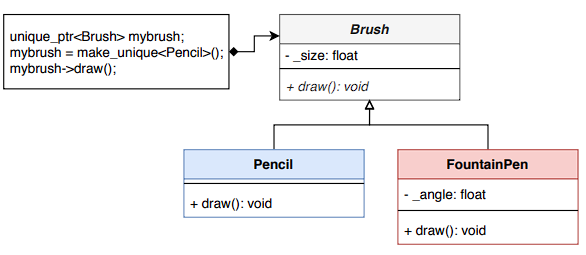

- [1. Classes: data + behavior](#1-classes-data--behavior)
  - [1.1 What is a class?](#11-what-is-a-class)
    - [1.1.1 Structures: grouping data together](#111-structures-grouping-data-together)
    - [1.1.2 Classes: more than grouping data](#112-classes-more-than-grouping-data)
  - [1.2 Access modifiers](#12-access-modifiers)
- [2. Constructors, destructor, special operators](#2-constructors-destructor-special-operators)
  - [2.1 Essential operations](#21-essential-operations)
  - [2.2 Constructors and destructor](#22-constructors-and-destructor)
  - [2.3 Operator overloading](#23-operator-overloading)
  - [2.4 Copy constructor](#24-copy-constructor)
  - [2.5 Default special member functions](#25-default-special-member-functions)
  - [2.6 Asking for defaults (or avoiding them)](#26-asking-for-defaults-or-avoiding-them)
- [3. Classes managing dynamic memory](#3-classes-managing-dynamic-memory)
  - [3.1 A path made of lines](#31-a-path-made-of-lines)
  - [3.2 Defining and copying paths](#32-defining-and-copying-paths)
  - [3.3 Copy constructors in cases of dynamic memory](#33-copy-constructors-in-cases-of-dynamic-memory)
  - [3.4 Deep copy vs shallow copy](#34-deep-copy-vs-shallow-copy)
  - [3.5 Copy-assigning paths](#35-copy-assigning-paths)
  - [3.6 Summary of part: classes `&` dynamic memory](#36-summary-of-part-classes--dynamic-memory)
- [4 Classes with constant members `&` methods](#4-classes-with-constant-members--methods)
  - [4.1 A point of *N*-dimensions](#41-a-point-of-n-dimensions)
  - [4.2 Member initializer lists](#42-member-initializer-lists)
  - [4.3 Getters `&` setters for our PointND](#43-getters--setters-for-our-pointnd)
  - [4.4 Summary of part: const-correctness](#44-summary-of-part-const-correctness)
- [4 Friend functions `&` classes](#4-friend-functions--classes)
  - [4.1 Friends of my class](#41-friends-of-my-class)
  - [4.2 Friendship details](#42-friendship-details)
- [5 Move semantics](#5-move-semantics)
  - [5.1 Instead of copying: moving (pointers)](#51-instead-of-copying-moving-pointers)
  - [5.2 Move constructor](#52-move-constructor)
  - [5.3 Move-assignment operator](#53-move-assignment-operator)
  - [5.4 Using the move operators](#54-using-the-move-operators)
  - [5.5 When \& why to use move operators](#55-when--why-to-use-move-operators)
  - [5.6 Two important rules](#56-two-important-rules)
- [6 Inheritance](#6-inheritance)
  - [6.1 Inheritance: A class diagram](#61-inheritance-a-class-diagram)
  - [6.2 Inheritance: C++](#62-inheritance-c)
  - [6.3 Under-the-hood: Inheritance](#63-under-the-hood-inheritance)
  - [6.4 protected access](#64-protected-access)
  - [6.5 Non-public inheritance](#65-non-public-inheritance)
- [7 Virtual functions](#7-virtual-functions)
  - [7.1 Redefining base class methods: UML](#71-redefining-base-class-methods-uml)
  - [7.2 Redening base class methods: C++](#72-redening-base-class-methods-c)
  - [7.3 Redeining base class methods: usage](#73-redeining-base-class-methods-usage)
  - [7.4 Virtual functions](#74-virtual-functions)
  - [7.5 Abstract methods (pure virtual functions)](#75-abstract-methods-pure-virtual-functions)
  - [7.6 Runtime polymorphism](#76-runtime-polymorphism)
    - [7.6.1 Runtime polymorphism: A common interface](#761-runtime-polymorphism-a-common-interface)
    - [7.6.2 Under-the-hood: Virtual Function Tables (1)](#762-under-the-hood-virtual-function-tables-1)
    - [7.6.3 Under-the-hood: Virtual Function Tables (2)](#763-under-the-hood-virtual-function-tables-2)
    - [7.6.4 Under-the-hood: Virtual Function Tables (3)](#764-under-the-hood-virtual-function-tables-3)
    - [7.6.5 Under-the-hood: Virtual Function Tables (4)](#765-under-the-hood-virtual-function-tables-4)
    - [7.6.6 Under-the-hood: Virtual Function Tables (5)](#766-under-the-hood-virtual-function-tables-5)
    - [7.6.7 Runtime polymorphism: Use virtual destructors](#767-runtime-polymorphism-use-virtual-destructors)
    - [7.6.8 Under-the-hood: Virtual Function Tables (6)](#768-under-the-hood-virtual-function-tables-6)
    - [7.6.9 Under-the-hood: Virtual Function Tables (7)](#769-under-the-hood-virtual-function-tables-7)
    - [Under-the-hood: Virtual Function Tables (8)](#under-the-hood-virtual-function-tables-8)
  - [7.7 Slicing: a common mistake](#77-slicing-a-common-mistake)
  - [7.8 Summary of part: Inheritance](#78-summary-of-part-inheritance)
- [8 Visitor pattern](#8-visitor-pattern)
  - [8.1 What are we designing for?](#81-what-are-we-designing-for)
  - [8.2 The classical Visitor design pattern](#82-the-classical-visitor-design-pattern)
  - [8.3 The classical Visitor design pattern (code glimpse)](#83-the-classical-visitor-design-pattern-code-glimpse)
  - [8.4 A modern C++ implementation of Visitor](#84-a-modern-c-implementation-of-visitor)

## 1. Classes: data + behavior

### 1.1 What is a class?

You have already seen classes and objects!

```cpp
// myvector and myothervector are objects of the 
// (templated) class std::vector<double> 
std::vector<double> myvector(3); 
std::vector<double> myothervector(2); 

// size() is a method (function) of std::vector that 
// returns the size that myvector internally stores 
myvector.size() == 3;

// push_back() checks that 2.71828 can be added to the vector, 
// adds it to it, and increases the size it knows. 
myvector.push_back(2.71828);

// Information-hiding: we cannot directly modify 
// the size that the vector knows.
```

#### 1.1.1 Structures: grouping data together

```cpp
struct Coordinate {
    double x; double y;
};

Coordinate point1;

point1.x = 2.0;
point1.y = -1.0;
```

#### 1.1.2 Classes: more than grouping data

```cpp
class Point {
    private:
        double _x = 0.0, _y = 0.0;
    public:
        Point() {} // default constructor, usually =default
        double x() { return _x; } double y() { return _y; }
};

Point point0; // a default point (0.0 , 0.0) 
std::cout << point0.x() << "\n";
```

### 1.2 Access modifiers
- **private**: (default) Only objects of the same class can access these members: point0._x in main() would not work. <br>
Other objects of the same class can still access private members of other objects of the same class.
- **protected**: Only objects of the same or derived classes can access these members (see part II of this lecture).
- **public**: Anyone can access these members: `point0.x()` is always allowed.

Why shouldn’t we make all member variables `public`?

- Only expose what is meant to be modified.
- Ensure that the object is modified consistently.
- Hide the implementation details (all the same for the user of the class).

## 2. Constructors, destructor, special operators

### 2.1 Essential operations

C++ classes define the following special member functions by default:

- **Constructor**: Create an object (initializing its members): `Point point1`;
- **Destructor**: Destroy the object when going out-of-scope.
- **Copy constructor**: Create an object given another object of the same type: `Point point2(point1)`;
- **Copy-assignment operator**: Assign one object to another object of the same type: point3 = point2;
- **Move constructor**: “Steal” the resources of an existing object to create a new one.
- **Move-assignment operator**: “Steal” the resources of another object and assign them to this object.

### 2.2 Constructors and destructor

```cpp
class Point {
    /* (as before) */ public:
    Point() {} // default constructor, usually =default

    Point(double x, double y){
        std::cout << "Creating a point\n"; _x = x; _y = y;
    }

    ~Point() {
        std::cout << "Destructing a point\n";
    }
};
```

**Setters: Ask before overwriting a member**

```cpp
class Point {
/* (as before) */

    Point(double x, double y){
        set_coordinates(x,y);
    }

    void set_coordinates(double x, double y) {
        // we only want points with positive coordinates 
        // (for any reason) 
        if (x > 0.0) _x = x; 
        if (y > 0.0) _y = y;
    } 
    /* ... */
};
```

**Let's use our Point class!**

```cpp
int main() {
    Point point1(2.0, -1.0); Point point2(4.0, 3.0);
    std::cout << "point1 x: " << point1.x()
              << " y: " << point1.y() << "\n";
}
```

```cpp
Creating a point 
Creating a point 
point1 x: 2 y: 0    //remember our positive coordinates requirement
point2 x: 4 y: 3 
Destructing a point 
Destructing a point
```

**Classes using other classes (composition)**

```cpp
class Line {
    private:
        std::array<Point, 2> _vertices;
    public:
        Line(Point startp, Point endp){
            _vertices[0] = startp; 
            _vertices[1] = endp;
        }
        double length() {
            return std::sqrt(
                std::pow(_vertices[1].x() - _vertices[0].x(), 2) + 
                std::pow(_vertices[1].y() - _vertices[0].y(), 2) );
        }
};
```

**From points to lines**

UML class diagram:


### 2.3 Operator overloading

```cpp
class Point {
    /* (as before) */

    Point operator-(const Point & other_point) {
        return Point( _x - other_point._x,
                     _y - other_point._y );
    }

    Point operator+(const Point & other_point) {
        return Point( _x + other_point._x,
                     _y + other_point._y );
    };
};

std::cout << (point1 + point2).x() << " "; // 6
```

### 2.4 Copy constructor

```cpp
class Line {
    /* (same as before) */
    public:
        Line(const Line & from_line){
            std::cout << "Copying a line\n";
            _vertices = from_line._vertices;
        }
};

Line line1(point1, point2); 
Line line2(line1); // make a copy of line1 
// equivalent: 
Line line3 = line1;
```

**Copy constructor: details**

- Even if `_vertices` is private, both lines are of the same class, so we can access all the private members of `from_line`.
- In the copy constructor, `const` matters, as it allows us to pass an rvalue: `Line line2( Line(point1, point2) )`;

### 2.5 Default special member functions

If we don’t explicitly define a constructor, destructor, and other special member functions, the compiler implicitly defines them.

Copying a point works without us having defined a copy constructor:

```cpp
void f(Point vertex) {
    std::cout << vertex.x() << "\n";
}

Point point1(2.0, -1.0);

// Pass-by-value, i.e., copy: 
f(point1);
```

Note: The default copy constructor copies member-by-member (details later).

### 2.6 Asking for defaults (or avoiding them)

If we define our custom constructor, the default constructor will not be generated and we can ask the compiler to also generate it:

```cpp
class Point {
    /* (as before) */
public:
    Point() = default; // notice the missing {}
    Point(double x, double y){ /* as before */ }
    Point(const Point & from_line) = delete;
    Point & operator=(const Point & from_line) = delete;
};
```

We can also forbid some operations, by deleting them: 
→ don’t allow copying points (compile-time error) 
→ remember: we are not allowed to copy a `std::unique_ptr` (stay tuned).

## 3. Classes managing dynamic memory

### 3.1 A path made of lines

```cpp
class Path {
    std::size_t _num_edges;
    Line * _edges; // raw pointer only to showcase an issue

public:
    Path(std::size_t num_edges, Line * edges){
        _num_edges = num_edges; _edges = new Line[_num_edges]; // assume Line() = default
        /* assign edges with a for loop */
    }

    ~Path(){
        // RAII: The same object that called new, also calls delete
        delete[] _edges;
    }
};
```


### 3.2 Defining and copying paths

**Path path2(path1)**

```cpp
// define point1, point2, point3
Line line1(point1, point2); 
Line line2(point2, point3); 
std::array<Line,2> lines({line1, line2});

Path path1(lines.size(), lines.data());

// What should happen here? 
Path path2(path1);
```

### 3.3 Copy constructors in cases of dynamic memory

```cpp
class Path {
    std::size_t _num_edges;
    Line * _edges;

    Path(const Path & from_path){
        _num_edges = from_path._num_edges;
        _edges = new Line[_num_edges]; // copy edges with a for loop
    }
};
```

### 3.4 Deep copy vs shallow copy


- **“deep copy”**: copy everything, including the dynamic memory <br>
→ this is what happens when we pass an std::vector by value.
- **“shallow copy”**: only copy the pointer (_edges), point to the same memory location → calling delete on both the from_path and the copy (e.g., at the destructors) leads to: error: double free or corruption
- See next: Copy-assignment operator
    - Copy constructor: path2(path1) path2 does not yet exist → we call new to allocate a Line array.
    - Copy-assignment operator: path2 = path1 path2 already exists. Calling new two times causes error.

**Copy-assignment operator**

```cpp
// define point1, point2, point3, point4

Line line1(point1, point2); 
Line line2(point2, point3); 
Line line3(point3, point4);

Path path1(line1, line2); 
Path path2(line2, line3);

// What should happen here?
path2 = path1;
```

```cpp
class Path {
    std::size_t _num_edges;
    Line * _edges;
    Path & operator=(const Path & from_path){
        _num_edges = from_path._num_edges;
        delete[] _edges; // clean-up before we assign
        _edges = new Line[_num_edges]; // assign edges with a for loop from from_path
        return *this;
    }
};
```

```cpp
class Path {
    std::size_t _num_edges;
    Line * _edges;

    Path& operator=(const Path& from_path){
        if(this != &from_path){
            _num_edges = from_path._num_edges;
            delete[] _edges; // clean-up before we assign
            _edges = new Line[_num_edges];
            /* assign edges with a for loop from from_path */
            return *this;
        } else return *this; // this: pointer to this object
    }
};
```

### 3.5 Copy-assigning paths

**Copy-assignment operator details for dynamic memory**

Some notes:

- For `std::unique_ptr`, we also need to decide how to handle it, as it does not allow copying (but not for `std::shared_ptr`)
- We first check if we are assigning the same object to itself: don't change/do anything, save operations.
- We first delete the previous pointer before we copy-assign, as the two dynamic arrays can be of different size. <br> → optimization potential.

### 3.6 Summary of part: classes `&` dynamic memory

- Default copy constructors copy member-by-member <br>
→ copy a pointer, but not the underlying dynamically allocated memory, if any (“shallow copy”).
- If a class contains pointers to dynamic memory, we need to also copy the memory pointed to (“deep copy”).
- If a class does not contain such pointers, the defaults are enough! :-)<br>
 → use `std::vector` instead of new[].
- Custom (copy) constructors can be useful in other cases, too:
    - constructing a 2D point as a projection of a 3D point: Point point2D(point3D);
    - copying a car, but giving it a new serial number: Car car2(car1);

## 4 Classes with constant members `&` methods

### 4.1 A point of *N*-dimensions

**UML class diagram**

| PointND |
|---|
|-\_N: const size_t <br>_coordinates: vector<double> |
| + PointND(size_t, vector<double>)<br> + get_coordinates() const: vector<double><br>+ set_coordinates(vector<double>): void|
   
```cpp
class PointND {
private:
    const std::size_t _N;
    std::vector<double> _coordinates;
public:
    PointND(std::size_t dimensions,
            std::vector<double> coordinates)
    {
        std::cout << "Constructing a PointND\n";
        _N = dimensions; // This does not work!
        _coordinates = coordinates;
    }
};

PointND point3D( 3, std::vector<double>({2.0, -1.0, 5.0}) );
```

### 4.2 Member initializer lists

**Initializing const members**

```cpp
class PointND {
    private:
        const std::size_t _N;
        std::vector<double> _coordinates;
    public:
        PointND(std::size_t dimensions,
                std::vector<double> coordinates)
        : _N(dimensions) // We have to initialize _N here
        {
            std::cout << "Constructing a PointND\n";
            _coordinates = coordinates;
        }
};
```

**Note**: Same requirement for initializing member references: `int & a`;

**Initializing any members**

```cpp
class PointND {
    private:
        const std::size_t _N;
        std::vector<double> _coordinates;
    public:
        PointND(std::size_t dimensions,
                std::vector<double> coordinates)
        : _N(dimensions), _coordinates(coordinates) {
            std::cout << "Constructing a PointND\n";
        }
};
```

Core Guideline [C.49](https://isocpp.github.io/CppCoreGuidelines/CppCoreGuidelines#c49-prefer-initialization-to-assignment-in-constructors): Prefer initialization to assignment in constructors

### 4.3 Getters `&` setters for our PointND

```cpp
class PointND {
    /* as before */

    std::vector<double> get_coordinates() {
        return _coordinates;
    }

    void set_coordinates(std::vector<double> new_coordinates) {
        _coordinates = new_coordinates;
    }
};

const PointND origin( 3, std::vector<double>({0.0, 0.0, 0.0}) );
origin.get_coordinates(); // Error: passing 'const PointND' 
// as 'this' argument discards qualifiers [-fpermissive]
```

**const methods to operate on const objects (or on any object)**

```cpp
class PointND {
    /* as before */

    std::vector<double> get_coordinates() const {
        return _coordinates;
    }

    void set_coordinates(std::vector<double> new_coordinates) {
        _coordinates = new_coordinates;
    }
};

const PointND origin( 3, std::vector<double>({0.0, 0.0, 0.0}) );
origin.get_coordinates(); // Works! :)
```

### 4.4 Summary of part: const-correctness

- On a `const` object, we can only call `const` methods.
- Useful in any object: making a method const specifies that calling it will not change the state of the object.
- Similar meaning to declaring function parameters (by reference) `const`: I promise not to change this parameter.<br>
→ `const` method: I promise not to change this object.

## 4 Friend functions `&` classes

### 4.1 Friends of my class

```cpp
class PointND {
    // I allow this function to access my private members
    friend ostream & operator<<(ostream &, const PointND &);
};

std::ostream & operator<<(ostream & to_stream,
                         const PointND & from_point) {
    for (auto c : from_point._coordinates) { // No getter!
        to_stream << c << " ";
    }
    return to_stream;
}

const PointND origin( 3, std::vector<double>({0.0, 0.0, 0.0}) );
std::cout << "Origin: " << origin << "\n";
```

### 4.2 Friendship details

We can also declare other classes as friends.

Use cases:

- Allow a unit testing class to access private members (check state).
- Strict encapsulation: make everything private, only allow specific friends.

Friendship is not:

- symmetric:<br>
`class A{friend class B;}; ⇏ class B{friend class A;};`
- inherited (see next section):<br>
`class A{friend class B;}; and class C : A{};` <br>
⇏ `class C{friend class B;};`

## 5 Move semantics

### 5.1 Instead of copying: moving (pointers)


Alternative: “steal” the array from path1, invalidating the pointer of path1.

### 5.2 Move constructor

```cpp
class Path {
    private:
        std::size_t _num_edges = 0;
        Line *_edges = nullptr;
    public:
        Path(Path&& from_path) {
            _num_edges = from_path._num_edges;
            _edges = from_path._edges;

            from_path._num_edges = 0;
            from_path._edges = nullptr;
        }
};
```

### 5.3 Move-assignment operator

```cpp
class Path {
    /* as before */
    Path& operator=(Path&& from_path) {
        if (this != &from_path) {
            _num_edges = from_path._num_edges;

            delete[] _edges;
            _edges = from_path._edges;

            from_path._num_edges = 0;
            from_path._edges = nullptr;
            return *this;
        }
        else return *this;
    }
};
```

### 5.4 Using the move operators

Remember: lvalue vs rvalue (b = a + 1)

- `b` is an lvalue
- `a + 1` is an rvalue
- `&` is an lvalue reference
- `&&` is an rvalue reference

To generate an && from an lvalue, we can use `std::move()`:

```cpp
Path path4(std::move(path1)); // Move constructor
path4 = std::move(path2); // Move-assignment operator
```

**Note**: `std::move` does not move anything (despite the name).

### 5.5 When & why to use move operators

- Passing dynamic resources to functions if no longer needed.
- Temporary objects: Constructor(std::string s): _s(std::move(s))
- Many STL methods move, if possible.
- A std::unique_ptr can only be moved, not copied (only one owner).

Remember: moving a resource invalidates the original pointer to it. We can only move resources if they are not needed anymore / in the meantime.

### 5.6 Two important rules

When should we define our own special functions (excluding constructors)?

- Usual case: no need to define our own copy, move or destructor function<br> 
  → [the rule of zero](https://isocpp.github.io/CppCoreGuidelines/CppCoreGuidelines#Rc-zero) 
  (aim for a class design that does not rely on, e.g., a special destructor)
- Special case: if you define (even =default) or delete any of the copy, move, or destructor function, define them all.<br>
  → [the rule of five](https://isocpp.github.io/CppCoreGuidelines/CppCoreGuidelines#Rc-five)


## 6 Inheritance

### 6.1 Inheritance: A class diagram

**A Stripe is a Line with thickness**


### 6.2 Inheritance: C++

```cpp
class Stripe : public Line {
private:
    int _thickness;
public:
    Stripe(Point startp, Point endp, int thickness) : Line(startp, endp) {
        std::cout << "Constructing a stripe\n";
        _thickness = thickness;
    }
};
```

**Using our stripe**

```cpp
Point point1(2.0, 0.0);
Point point2(6.0, 3.0);
Stripe mystripe(point1, point2, 10);
std::cout << "Length of stripe: " << mystripe.length()
          << "\n";
```

```bash
(Constructing point1, point2)
Constructing a line
Constructing a stripe
Length of stripe: 5
Destructing a stripe
Destructing a line
(Destructing point1, point2)
```

### 6.3 Under-the-hood: Inheritance


### 6.4 protected access

**Only me and my children**

Remember what Line contained:

```cpp
class Line {
private:
    std::array<Point, 2> _vertices;
    /* more */
};
```

Would the following work?

```cpp
Stripe::Stripe(Point startp, Point endp, int thickness)
: Line(startp, endp){ // access _vertices in line from stripe
auto x = Line::_vertices;
}
```

→ No: `_vertices` is **private** and Stripe is only a child, not a friend.
Solution: make _vertices a **protected** member of `Line`

**UML: protected access as #**


### 6.5 Non-public inheritance

We already saw `public` inheritance:

```cpp
class Stripe : public Line { /* as before */ };
```

All the members of Line retain their access levels (maximum level: public).

We can also have `protected` or `private` inheritance:

```cpp
class Stripe : protected Line { /* as before */ };
```

In `protected` inheritance:

- `public` members of Line become `protected`
- `protecte`d members remain `protected`
- `private` members remain `private`

In `private` inheritance, all the members become `private`.


## 7 Virtual functions

### 7.1 Redefining base class methods: UML

**A hierarchy of brushes**

Both Pencil and FountainPen are brushes, but they can draw() in their own special way:


### 7.2 Redening base class methods: C++

**Different brushes draw differently**

```cpp
class Brush {
    public: void draw() {
        std::cout << "I am a generic brush, I don't know how to draw\n";
        }
};
class Pencil : public Brush {
    public: void draw() {
            std::cout << "Drawing with a Pencil\n";
        }
};
class FountainPen : public Brush {
    public: void draw() {
            std::cout << "Drawing with a FountainPen\n";
        }
};
```

### 7.3 Redeining base class methods: usage

We can select different brushes at compile time:


Two wishes:

1. Can we enforce that all brushes implement draw()?
2. Can we select a Brush at runtime, depending on what the user needs?

### 7.4 Virtual functions

Virtual functions may be implemented in a derived class. 

We can use the following modifiers with virtual functions:

- `= 0`: Not implemented: Brush is abstract.
- `override`: Intending to redefine it (must exist in base). Optional, but nice.
- `final`: Cannot be overridden in a derived class.

```cpp
class Brush {
    private:
        float _size;
    public:
        virtual void draw() = 0;
};
class Pencil : public Brush {
    public:
        void draw() override {/* ... */}
};
class FountainPen : public Brush {
    private:
        float _angle;
    public:
        void draw() override {/* ... */}
};
```

### 7.5 Abstract methods (pure virtual functions)

Abstract methods **must** be defined in a derived class to make it concrete – otherwise, we cannot create an object.

```cpp
// In class Brush: 
virtual void draw() = 0;

// In class Pencil: 
void draw() override {
    std::cout 
    << "Drawing with a Pencil" 
    << "\n";
}

// In main(): 
Brush mybrush; 
// error: cannot declare variable 
// 'mybrush' to be of abstract 
// type 'Brush'
Pencil mybrush; // Works! 
mybrush.paint();
```

### 7.6 Runtime polymorphism

**Selecting a Brush at runtime**



#### 7.6.1 Runtime polymorphism: A common interface

A function `paint(std::unique_ptr<Brush> &)` 
that accepts any kind of Brush:


**Remember**: This only works using a pointer to a common base class with a `virtual` (but not necessarily implemented) draw().

#### 7.6.2 Under-the-hood: Virtual Function Tables (1)

**One vtable per class**


#### 7.6.3 Under-the-hood: Virtual Function Tables (2)

**Derived classes copy (and, if needed, extend) the base vtable**


#### 7.6.4 Under-the-hood: Virtual Function Tables (3)

**Where to bind a Brush pointer?**


#### 7.6.5 Under-the-hood: Virtual Function Tables (4)

**Where to bind a Brush pointer?**


#### 7.6.6 Under-the-hood: Virtual Function Tables (5)

**Which draw() to call?**


#### 7.6.7 Runtime polymorphism: Use virtual destructors

A caveat when managing a derived object through a base pointer: which destructor (assume non-virtual) is being called?

```cpp
{
    unique_ptr<Brush> mybrush; mybrush = std::make_unique<Pencil>();
}
// out-of-scope: need to destruct Pencil and the included Brush
```

However, here only the Brush destructor will be called, potentially leaking the memory that Pencil manages.

Therefore: declare the Brush destructor as `virtual`:

```cpp
virtual ~Brush() {}
```

#### 7.6.8 Under-the-hood: Virtual Function Tables (6)

**Which destructor to call?**


#### 7.6.9 Under-the-hood: Virtual Function Tables (7)

**What if the destructor was not virtual?**


#### Under-the-hood: Virtual Function Tables (8)

**What if the destructor was not virtual?**


### 7.7 Slicing: a common mistake

**Assigning or copying a derived class object to a base class object**

```cpp
virtual void Brush::draw() { cout << "Painting with a Brush"; }
void Pencil::draw() override { cout << "Painting with a Pencil"; }
Brush mybrush = Pencil(); mybrush.draw();
```

Output: Painting with a Brush

Same problem without `virtual`


→ Do not copy, prefer pass-by-reference.<br>
→ Use a (smart) pointer when implementing runtime polymorphism.<br>
→ Do not rely on the default copy constructor (bitwise copy).

### 7.8 Summary of part: Inheritance

Two reasons to use inheritance:

- **Implementation inheritance**: reuse code from parent classes, make derived classes simpler.
- **Interface inheritance**: the base class specifies an interface, which the derived classes implement. Usually, but not always, this means an abstract base class: purely virtual function(s).

Remember:

- We can redefine methods in derived classes.
- `virtual` methods may be defined later (small performance penalty).
- Purely `virtual (= 0)` methods must be defined later.
- Ability to define interfaces and get runtime polymorphism.
- Be careful with destructors when implementing runtime polymorphism: make the base class destructor `virtual`.
- Be careful of slicing when copying or assigning: Base = Derived <br>→ Prefer pass-by-reference, use a (smart) pointer for polymorphism.

## 8 Visitor pattern

### 8.1 What are we designing for?

**Designing for adding new types**: <br>
To add a new kind of brush, just add a new derived class. 
However: Adding a new operation means editing every class.

**Designing for adding new operations**: <br>
Visitor design pattern: To add a new operation, just add a new Visitor class.

### 8.2 The classical Visitor design pattern


### 8.3 The classical Visitor design pattern (code glimpse)

```cpp
class Pencil : public Brush {
    public: void accept(const BrushVisitor & v) override { v.visit(*this); }
};
```

```cpp
class Draw : public BrushVisitor {
    public: void visit(const Pencil &) const override { std::cout << "Draw with a pencil\n"; }
    public: void visit(const FountainPen &) const override { std::cout << "Draw with a pen\n"; }
};
```

```cpp
int main(){
    std::unique_ptr<Brush> mybrush;
    mybrush = std::make_unique<Pencil>();

    mybrush->accept( Draw{} );
    mybrush->accept( Erase{} ); // Just another BrushVisitor
}
```

### 8.4 A modern C++ implementation of Visitor

```cpp
class Pencil{}; // Does not derive from any base class, nothing special
```

```cpp
class Draw { // Only definining operator() for different types
    public: void operator()(const Pencil&) const { std::cout << "Draw with a pencil\n"; }
    public: void operator()(const FountainPen&) const { std::cout << "Draw with a pen\n"; }
};
```

```cpp
int main(){
    using Brush = std::variant<Pencil, FountainPen>; // Store either a Pencil or a FountainPen
    Brush pen{};                                      // pen is default-initialized to Pencil
    pen = FountainPen{};                              // pen is now a FountainPen

    std::visit(Draw{}, pen);
    std::visit(Erase{}, pen);
}
```