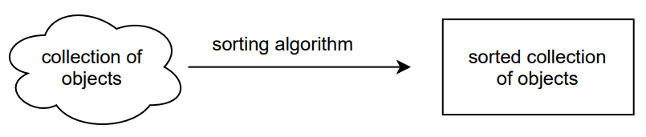
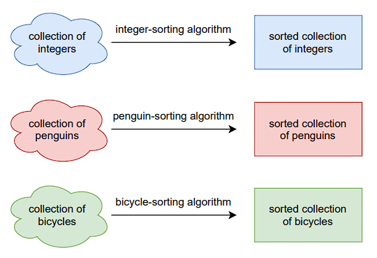
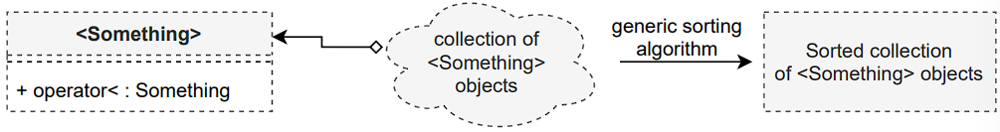

- [1. Function and class templates](#1-function-and-class-templates)
  - [1.1 Example problem: sorting](#11-example-problem-sorting)
- [2 What do templates do?](#2-what-do-templates-do)
  - [2.1 Function templates: basics](#21-function-templates-basics)
  - [2.2 Function templates: requirements](#22-function-templates-requirements)
  - [2.3 Can we generalize this idea to classes?](#23-can-we-generalize-this-idea-to-classes)
  - [2.3.1 Class templates: basics](#231-class-templates-basics)
  - [2.3.2 Class templates with multiple types](#232-class-templates-with-multiple-types)
- [3 Evaluation at compile time](#3-evaluation-at-compile-time)
  - [3.1 What does the compiler generate?](#31-what-does-the-compiler-generate)
  - [3.2 Non-type template parameters](#32-non-type-template-parameters)
  - [3.3 Class templates in class templates](#33-class-templates-in-class-templates)
- [4 Template specialization](#4-template-specialization)
  - [4.1 Two-phase lookup](#41-two-phase-lookup)
- [4.2 First- and second-phase errors](#42-first--and-second-phase-errors)
- [5 Variadic templates](#5-variadic-templates)
- [6 Impact](#6-impact)
- [7 There is more on templates](#7-there-is-more-on-templates)
- [8 Issues with templates](#8-issues-with-templates)
- [9 C++20: Constraints and concepts](#9-c20-constraints-and-concepts)
- [10 Summary: Generic programming with C++ templates](#10-summary-generic-programming-with-c-templates)

## 1. Function and class templates

### 1.1 Example problem: sorting



- Given: Generic algorithm, which sorts objects
- Goal: Apply this algorithm to all objects which are sortable (i.e., `operator`< is defined)

**Which options have we seen so far?**

**Option 1: copy & paste**



Copy & paste the implementation for all the types which we want to compare → not sustainable.

**Option 2: inheritance**


Drawbacks:
  - Not type-safe → comparison of bicycles and penguins.
  - Each object we want to compare needs to inherit from Sortable.
  - Virtual function tables introduce performance overhead.

**Option 3: templates**



Remember how we always define vectors:

```cpp
std::vector<double> doubles;
std::vector<std::string> strings;
std::vector<Brush> brushes;
```

This is a templated type `std::vector<T>`, where `T` is any type.

## 2 What do templates do?

- Function and class templates only define a **generic layout**.
- Compiler generates (“instantiates”) **implementations** for any requested types, such as `std::vector<double>`, and only for these types.
- High-level code provides a **single implementation** of an algorithm.
- Generation happens at **compile time** → no performance overhead.

Note: We cannot (nicely) split templates into a declaration and a definition part. We usually write the complete template of a function/class in a header file. Remember: a function/class template is not a function/class yet. The compiler will generate concrete functions/classes when we give a type: e.g., when we write sort<Penguin> in our main.cpp.

### 2.1 Function templates: basics

```cpp
template<typename T> T add(T first, T second) {
  return first + second;
}
int main() {
  std::cout << add(3, 5) << "\n";
  std::cout << add(3.0, 5.0) << "\n";
  std::cout << add(std::string("3"), std::string("5")) << "\n";
}
```

Does this work for any type T? <br>
Does it work for our `Point`? Does it work for our `Line`?

### 2.2 Function templates: requirements

```cpp
template<typename T> 
T add(T first, T second) {
  return first + second;
}

class Point{
private:
  double _x = 0.0, _y = 0.0;
  /* as before, only constructor, destructor, get/set */
};

int main() {
  Point point1(1.0, 1.0), point2(2.0, 2.0);
  std::cout << add(point1, point2) << "\n";
}
```

**Will this work?**<br>
No, `add` does not know how to add class Point

**This will indeed work:**

```cpp
template<typename T> T add(T first, T second) {
  return first + second;
}

class Point{ /* as before */
  Point operator+(const Point& other_point){
    return Point(_x + other_point._x, _y + other_point._y);
  }
};

int main() {
  Point point1(1.0, 1.0), point2(2.0, 2.0);
  std::cout << add(point1, point2) << "\n";
}
```

### 2.3 Can we generalize this idea to classes?

```cpp
class PairInt {
    int _first, _second;
   public:
    PairInt(int first, int second);
};

class PairDouble {
    double _first, _second;
   public:
    PairDouble(double first, double second);
};

int main() {
PairInt pair_int(1, 2); PairDouble pair_double(1.0, 2.0);
}
```

### 2.3.1 Class templates: basics

One class template for any type:

```cpp
template<typename T> 
class Pair {
    T _first, _second;
   public:
    Pair(T first, T second);
};

int main() {
  Pair<int>         pair_int(1, 2);
  Pair              pair_double(1.0, 2.0);
  Pair<std::string> pair_string("hello", "world"); 
  // The `<>` part in *class* templates is optional in C++17 or newer
}
```

Every instance of a template is a different type:

```cpp
template<typename T> 
class Pair {
  T _first, _second; 
  public:
   Pair(T first, T second);
};

int main() {
  Pair              pair_double(1.0, 2.0);
  Pair<std::string> pair_string("hello", "world"); 
  pair_double = pair_string; // This does not work: different types
}
```

These types are not related in any way to each other, even if their internal behavior is similar, as their code was generated by the same template.

### 2.3.2 Class templates with multiple types

Pairs of different kinds:

```cpp
template<typename T1, typename T2> 
class Pair {
  T1 _first; 
  T2 _second; 
  public:
   Pair(T1 first, T2 second);
};

int main() {
  Pair                  pair_int_double(1, 3.14);
  Pair<int,std::string> pair_int_string(42, "world");
}
```

## 3 Evaluation at compile time

### 3.1 What does the compiler generate?

```cpp
template<typename T1, typename T2>
class Pair {
    T1 _first;
    T2 _second;
    public:
        Pair(T1 first, T2 second);
        T1 getFirst();
        T2 getSecond();
};
int main() {
    Pair<int, std::string> pair_int_string(42, "world");
    std::cout << pair_int_string.getFirst() << "\n";
}
```

Here, `getSecond() is not mentioned $\to$ not generated in the binary.

### 3.2 Non-type template parameters

Remember `std::array<T, size>`. Similarly:

```cpp
template<typename T, size_t dimensions> 
class PointND {
    std::array<T, dimensions> _coordinates;
   public:
    PointND(std::array<T, dimensions> coordinates);
};
int main() {
  PointND<int, 3> point3D(std::array<int, 3>({0,0,0}));
}
```

- size known at compile-time
- PointND`<int,2>` is a different type than PointND`<int,3>`

### 3.3 Class templates in class templates

```cpp
int main() {
  PointND<double, 3> xyz(std::array<double, 3>({5.0, 3.0, 2.0}));
  PointND<double, 2> xy(std::array<double, 2>({5.0, 3.0}));

  Pair<PointND<double, 3>, PointND<double, 2>> projection(xyz, xy);

  // or, implicitly: 
  Pair projection(xyz, xy);
}
```

## 4 Template specialization

**Special-case implementation for specific types**

```cpp
template<typename T, size_t dimensions> 
class PointND {
    std::array<T, dimensions> _coordinates;
   public:
    PointND(std::array<T, dimensions> coordinates);
};

template<typename T> 
class PointND<T, 2> {   // Special case for 2D points:
    T _x, _y;           // just x,y instead of a coordinates array
   public:
    PointND(std::array<T, 2> coordinates): 
    _x(coordinates[0]), _y(coordinates[1]);
};
```

### 4.1 Two-phase lookup

Compilation in two phases:

- First Phase
    - When the template is initially parsed
    - Lookup of non-dependent names and check of all non-template specific syntax.
- Second Phase
    - When an instance of the template for a specific type is created (all information is present)
    - Lookup of dependent names and check of dependent syntax

## 4.2 First- and second-phase errors

```cpp
template<typename T>
T add(T first, T second){
  return first + second[]; //first-phase: wrong syntax
}
class Point{
    double _x = 0.0, _y = 0.0;
public:
    Point(double x, double y): _x(x), _y(y) {}
};

int main(){
  Point point1(3.0, 5.0), point2(2.0, 6.0);
  /* second-phase error: no operator+ for Point */
  auto result = add(point1, point2);
}
```

## 5 Variadic templates

Functions with any number of arguments

```cpp
template<typename... Types> // Yes, the ... is part of the syntax
auto sum(Types... args){
  return (Types + args);
}

int main(){
  float x = 1.1; 
  double y = 2.5; 
  int z = 4; 
  double p = 3.14;
  std::cout << sum(x, y, z, p) << "\n";
}
```

Such a parameter `pack (...)` can be combined with normal arguments, but it can only appear at the end of the arguments list. [see notes]

## 6 Impact

- Performance is the same as for specialized non-templatized functions/classes.<br>
  Remember: a template is not a function/class, but it generates functions/classes at compile-time.
- Heavily-templatized codes tend to have a very long compilation phase and often very large error output. <br>
  Due to the two-phase lookup, this output can often be cryptic.

## 7 There is more on templates

**...but it gets complicated quickly.**

**Template meta-programming**: evaluate code at compile-time. Example: a factorial at compile-time (https://compiler-explorer.com/z/8ror9e)

**Expression templates**: Evaluate expressions as needed. Allows bypassing the normal order of evaluation and eliminate temporary objects. Example: add three large vectors (https://en.wikipedia.org/wiki/Expression_templates)

Templates are a language on their own – you may simply not need them.

## 8 Issues with templates

- Compatibility of types only described in documentation, not in the language. 
  Using templates, you don’t communicate your intention to the compiler (as with strong types).
- Cryptic error messages when using non-compatible types.
- Complicated to enforce restrictions on types.

## 9 C++20: Constraints and concepts

```cpp
// Define a concept Addable for type T:
// T must be a type that we can add.
template<typename T> 
concept Addable = requires(T x) { x + x; };
// Expression x + x evaluated early: clear error message (if any):
// "the required expression '(x + x)' is invalid"

// Use the concept: T must be an Addable type
template<Addable T> 
T add(T first, T second){
    return first + second;
}
int main(){
  auto result = add(point1, point2);
}
```

```cpp
template<typename T> 
concept HasSize = requires(T m){
  m.size();  // has size member function
};

template<HasSize T> 
void print_size(T obj){
    std::cout << obj.size() << "\n";
}
int main(){
  Point<int> x; 
  print_size(x); 
  print_size(5); // error: does not have a size
}
```
→ Many predefined concepts in the concepts library.

## 10 Summary: Generic programming with C++ templates

- Templates: Code formulated for any type.
- Function templates & class templates.
- Declare with `template<typename T>` (equivalent: `template<class T>`)
- Instantiate and use as, e.g., `std::vector<double>`
- We can specialize templates for specific types.
- Variadic templates can work with any number and type of arguments.
- A world of idioms: expression templates, variadic templates, ...
- C++20: Type constraints with concepts.