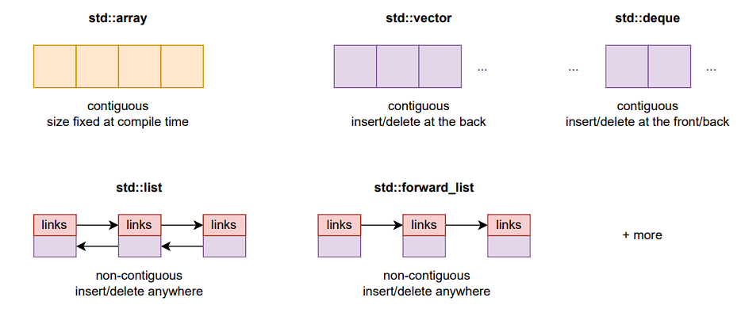
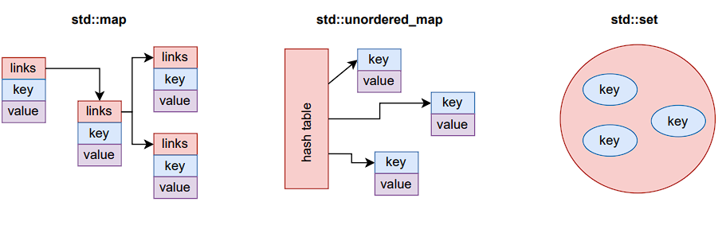
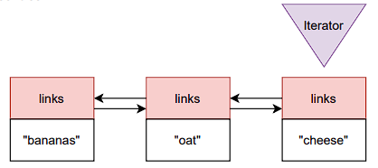

- [1 Overview of the Standard Library](#1-overview-of-the-standard-library)
  - [1.1 What we are already using](#11-what-we-are-already-using)
  - [1.2 Our focus in this block](#12-our-focus-in-this-block)
- [2 Containers](#2-containers)
  - [2.1 A simple container: `std::vector`](#21-a-simple-container-stdvector)
  - [2.2 Vector, deque, and list](#22-vector-deque-and-list)
  - [2.3 Map and unordered map](#23-map-and-unordered-map)
  - [2.4 Overview of sequence containers](#24-overview-of-sequence-containers)
  - [2.5 Overview of associative containers](#25-overview-of-associative-containers)
- [3 Iterators](#3-iterators)
  - [3.1 Iterator types](#31-iterator-types)
- [4 Algorithms + ranges](#4-algorithms--ranges)
  - [4.1 Generating numbers](#41-generating-numbers)
  - [4.2 Finding the maximum element in a vector](#42-finding-the-maximum-element-in-a-vector)
  - [4.3 Finding the maximum element in any container](#43-finding-the-maximum-element-in-any-container)
  - [4.4 Sorting](#44-sorting)
  - [4.5 More algorithms](#45-more-algorithms)
    - [4.5.1 `std::accumulate`: Sum up elements](#451-stdaccumulate-sum-up-elements)
    - [4.5.2 `std::transform`: Transform data to other data](#452-stdtransform-transform-data-to-other-data)
    - [4.5.3 `std::for_each`: Apply a function on each element](#453-stdfor_each-apply-a-function-on-each-element)
    - [4.5.4 `std::find`: Find an element in a container](#454-stdfind-find-an-element-in-a-container)
    - [4.5.5 `std::find_if`: Find an element that satisfies some condition](#455-stdfind_if-find-an-element-that-satisfies-some-condition)
  - [4.6 Predicates](#46-predicates)
  - [4.7 Parallel algorithms / Execution policy](#47-parallel-algorithms--execution-policy)
  - [4.8 Ranges library (C++20)](#48-ranges-library-c20)
  - [4.9 Composing ranged algorithms (C++20)](#49-composing-ranged-algorithms-c20)
  - [4.10 It’s dangerous to go alone, take this list of algorithms](#410-its-dangerous-to-go-alone-take-this-list-of-algorithms)

## 1 Overview of the Standard Library

**the Standard Template Library**

A collection of additional C++ features, defined by the standard, but with compiler-specific implementation.

Common building blocks that are already implemented, tested, and optimized for a wide range of use cases <br>
→ probably better than our implementation.

### 1.1 What we are already using

- `std::cout` from `<iostream>`
- `std::string` from `<string>`
- `std::vector` from `<vector>`
- `std::unique_ptr` from `<memory>`
- `std::uniform_int_distribution` from `<random>`
- `std::function` from `<functional>`
- `std::max` from `<algorithm>`

### 1.2 Our focus in this block

- **Containers**: Ways to organize our data
- **Iterators**: Ways to walk through our data
- **Algorithms**: Ways to perform common operations on our data

Disclaimer: We will only talk about a tiny part of the standard library. But you can get the point.

## 2 Containers

A container is a collection of data, structured in a particular way.

Containers you already know: `std::vector`, `std::array`, `std::map`.

C++ provides different kinds of containers, mainly:

- **Sequence containers**: array, vector, list, forward_list, deque, ...
- **Associative containers**: set, map, ...
- **Unordered associative containers**: unordered set, unordered map, ...

### 2.1 A simple container: `std::vector`

Technically, a container is a class template, which provides methods to easily navigate the data inside the container.

Remember a vector: `std::vector<double> myVector`

`myVector`

- contains some data, here a `double * data`, which it allocates and deallocates automatically
- knows the `.size()` of the vector
- provides `operator[]`
- provides the vector’s `.begin()` and `.end()`
- provides access to `.data()`, if needed

Many of these properties also appear in `std::array` and other containers.

### 2.2 Vector, deque, and list

**Vector**

- Contiguous: elements next to each other in the memory
- We can access elements randomly: `myVector[i]` is at `myVector.data()+i`

**Double-ended queue (deque)**

- Same as vector, but as easy to push_front as it is to push_back.

**Double-linked list and forward list**

- Non-contiguous: elements are not necessarily next to each other (cache-inefficient)
- Every element knows which element is before and after it (or only after, in `std::forward_list)`
- We can traverse a list front-to-back or back-to-front, but not randomly.

### 2.3 Map and unordered map

**Map**

- Key-value pairs (also known as “dictionary” or “associative array”)
- Non-contiguous, implemented as a balanced binary tree
- Keys are sorted (O(log(N)) lookup), requires operator<
- Accessed as `my_map[my_key]`
- Careful: If a key is not found, it is automatically inserted, with default value!

**Unordered map**

- Same as map, but implemented as hash table – all hash-table variants in STL are called “unordered”
- Keys are not sorted, but hashed (requires operator==)
- Given a good hash function, unordered_map can be much faster than map for large containers (but poor hash function can lead to far worse complexity)

**Similarly**: `std::map` / `std::unordered_map` with only keys (not values) → `std::set` / `std::unordered_set`

### 2.4 Overview of sequence containers



### 2.5 Overview of associative containers



## 3 Iterators



An iterator provides a general way to traverse over any C++ container.

An iterator is usually implemented as a class, which provides operations such as operator++.

However, the type of iterator can differ for each container:
- An `std::vector` can be accessed randomly.
- An `std::list` can only be accessed serially, forward or reverse.

### 3.1 Iterator types

Every iterator supports ++ (next element) and * (dereference)
Different iterator types support different operations:

- Forward: * and ++ (e.g., `std::forward_list`)
- Bidirectional: same as Forward, with -- (e.g., `std::list`)
- RandomAccess: as Bidirectional, with +, -, +=, -=, [] (e.g., `std::vector`)
- Also: Input (read-only), Output (write-only), and more iterators.

→ An `std::list` cannot be sorted with `std::sort`, because this needs a random access iterator, while a `std::list` only provides a bidirectional iterator. (For this reason, there is a `list.sort()` instead.)

## 4 Algorithms + ranges

### 4.1 Generating numbers

How to fill a vector of ten elements with values from 100 to 109?

The “traditional” approach:

```cpp
std::vector<int> v(10); // { 0, 0, 0, 0, 0, 0, 0, 0, 0, 0}

int value=100; 
for(auto i=0; i<v.size(); ++i){
  v[i] = value++;
} // {100, 101, 102, 103, 104, 105, 106, 107, 108, 109}
```

A simpler way:

```cpp
std::vector<int> v(10);
std::iota(v.begin(), v.end(), 100); // Name: Not an acronym, just the Greek letter, referring to integers, originating from the APL language
```

### 4.2 Finding the maximum element in a vector

The “traditional” approach:

```cpp
std::vector<int> myVector{1, 5, 2, 13, 7};
int max_element_value = myVector[0];
for (auto elem : myVector){
  if (elem > max_element_value){
    max_element_value = elem;
  }
}
```

The C++98 way:

```cpp
max_element_value = *std::max_element(myVector.begin(), myVector.end()); // dereference!
```

### 4.3 Finding the maximum element in any container

The same approach works with other containers, as well:

```cpp
std::list<std::string> myList{"bananas", "oat", "cheese", "coffee", "oat", "apples"};
auto max_list_elem_value = *std::max_element(myList.begin(), myList.end());

// Similarly for sets: 
std::set<std::string> mySet{"C++11", "C++98", "C++20", "C++17"};
auto max_set_elem_value = *std::max_element(mySet.begin(), mySet.end());
```

To find the maximum in more complex containers, we use a lambda (predicate) to tell std::max_element how to compare the data:

```cpp
std::map<std::string, int> myMap{{"Alice", 165}, {"Bob", 163}, {"Chris", 185}, {"Dora", 170}};

auto max_map_elem_value =
  *std::max_element(
    myMap.begin(), myMap.end(),
    [](auto & p1, auto & p2){return p1.second < p2.second;}
  );
  ```

The lamda implements the comparison operator: 
it expects two elements as arguments and returns true or false

### 4.4 Sorting

We can sort a vector easily:

```cpp
std::vector<int> myVector{1, 5, 2, 13, 7};
std::sort(myVector.begin(), myVector.end());
```

The sorting algorithm “walks” on the vector and rearranges the elements.<br> It needs to be able to access the elements in any order.
Can we also sort a list?

```cpp
std::list<std::string> myList{"bananas", "oat", "cheese", "coffee", "oat", "apples"};
std::sort(myList.begin(), myList.end());
```

This does not work: we cannot randomly “walk” on a list.

`std::sort()` does not necessarily preserve the order of equivalent elements.
For example, the original:

`"bananas", "oat", "cheese", "coffee", "oat", "apples"`

could become either of:

```cpp
"apples", "bananas", "cheese", "coffee", "oat", "oat" (variant A)
"apples", "bananas", "cheese", "coffee", "oat", "oat" (variant B)
```

`std::stable_sort()` guarantees that the order will be preserved (always leading to variant A).

Complexity:

- `std::sort()`: O(N · log(N))
- `std::stable_sort()`: O(N · log(N^2)) → safety comes at a cost; when is the order relevant?

### 4.5 More algorithms

Common examples:

- `std::accumulate`: Accumulate the values
- `std::transform`: Transform data to other data
- `std::for_each`: Apply a function on each element
- `std::find`: Find an element in a container
- `std::find_if`: Find an element that satisfies some condition

Let’s see how we can use such algorithms...

#### 4.5.1 `std::accumulate`: Sum up elements

Accumulate all the values, starting from zero:

```cpp
std::vector<int> myVector{1, 5, 2, 13, 7};
auto sum = std::accumulate(myVector.begin(), myVector.end(), 0);
std::cout << "Vector sum: " << sum << std::endl;
```

(include `<numeric>`)

#### 4.5.2 `std::transform`: Transform data to other data

Apply $f(x) = x^2$ to `myVector` and store the result to `transformed`:

```cpp
std::vector<int> myVector{1, 5, 2, 13, 7};
std::vector<int> transformed(myVector.size());

std::transform(myVector.begin(), myVector.end(),  // Input
               transformed.begin(),               // Output
               [](int & x){return x*x;});         // Operation
```

#### 4.5.3 `std::for_each`: Apply a function on each element

```cpp
// A Caesar encryption (of lowercase English characters) 
// Don't worry about the implementation of this.
void encrypt(std::string & message) {
  const int offset = 7;
  for (auto i = 0; i < message.size(); i++){
    message[i] = (((message[i] - 'a') + offset) % 26) + 'a';
  }
}
// Our shopping list 
std::list<std::string> myList{"bananas", "oat", "cheese", "coffee", "oat", "apples"};
// Calling encrypt (a function expecting one argument) on each element 
std::for_each(myList.begin(), myList.end(), encrypt);
```

#### 4.5.4 `std::find`: Find an element in a container

```cpp
std::list<std::string> myList{"bananas", "oat", "cheese", "coffee", "oat", "apples"};

// Do we already have milk in the list? 
// Returns an iterator to the first "milk", if found. 
auto milk_in_basket = std::find(myList.begin(), myList.end(), "milk");

// If we already went out of the list while searching, 
// insert "milk" at the end (yes, push_back also works). 
if (milk_in_basket == myList.end()){
  myList.insert(myList.end(), "milk");
}
```

#### 4.5.5 `std::find_if`: Find an element that satisfies some condition

```cpp
bool is_fruit(std::string & x){
  std::set<std::string> fruits{"apples", "pears", "bananas"};
  return std::find(fruits.begin(), fruits.end(), x) != fruits.end(); // Why not <= end?
}

std::list<std::string> myList{"chocolate", "chips", "coffee"};

// We definitely need to buy fruit! 
auto fruit_in_basket = std::find_if(myList.begin(), myList.end(), is_fruit);

if (fruit_in_basket == myList.end()){
  std::cout << "No fruit found. An apple a day keeps the doctor away!\n";
}
```

### 4.6 Predicates

| Acting based on the values themselves | Acting based on predicates |
|---|---|
| std::find(b, e, value)<br>std::count(b, e, value)<br>std::replace(b, e, old\_value, new\_value)<br>std::copy(b, e, target)<br>std::sort(b, e, predicate)<br>... | std::find_if(b, e, predicate)<br>std::count\_if(b, e, predicate)<br>std::replace_if(b, e, predicate, new_value)<br>std::copy_if(b, e, target, predicate)<br>std::sort(b, e, predicate)<br>... |

predicate: Something we can invoke to return `true` or `false` (e.g., `is_fruit()`).

### 4.7 Parallel algorithms / Execution policy

Most STL algorithms can be executed in parallel (since C++17):

```cpp
// A very large vector of random values 
std::vector<int> myVector(1000000);
std::generate(myVector.begin(), myVector.end(), std::rand);
std::sort(std::execution::par, myVector.begin(), myVector.end());
```

Execution policy (hints for the compiler):

- **seq**: sequential (default)
- **par**: parallel → multiple threads on multiple cores
- **par_unseq**: parallel and/or vectorized

(include `<execution>`, link to Intel TBB library with `-ltbb`)

### 4.8 Ranges library (C++20)

A range is something we can iterate over, from .begin() to .end():

```cpp
std::vector<int> myVector{1, 5, 2, 13, 7, 4};

// C++98 sorting: 
std::sort(myVector.begin(), myVector.end());

// C++20 ranged sorting: 
std::ranges::sort(myVector);
```

### 4.9 Composing ranged algorithms (C++20)

Ranges also enable some advanced, high-level functionality:

```cpp
std::vector<int> myVector{1, 5, 2, 13, 7, 4};
// A composition of operation:
// 1. Create a view v of myVector
// 2. Filter out odd elements
// 3. Apply f(x)=x^2 to the remaining elements
auto v = myVector
  | std::views::filter( [](auto i){ return i % 2 == 0; } )
  | std::views::transform( [](auto i){ return i*i; } );
// Result: {4, 16} 
// (lazy evaluated, only when we access v -> cheap!)
```

### 4.10 It’s dangerous to go alone, take this list of algorithms

- `iota`: Generate a sequence of integers
- `generate`: Generate values based on a function
- `min_element` / `max_element`: Find the element with the min/max value
- `sort` / `stable_sort`: Sort without/with guaranteeing order
- `accumulate`: Accumulate values
- `transform`: Transform data to other data
- `for_each`: Iterate over all
- `find` / `find_if`: Find elements (that satisfy some predicate)
- `count` / `count_if`: Count occurrences
- `replace` / `replace_if`: Replace occurrences of A with B
- `copy` / `copy_if`: Copy each (satisfying some predicate) to a target
- `shuffle`: Shuffle the elements
- `remove` / `remove_if`: Remove elements
- `any_of / all_of / none_of`: Any/all/none elements satisfying a predicate
- `reduce`: Numerical reduction operation
- `inner_product` Numerical inner product of two vectors ... 

and many more numerical algorithms coming in C++26.