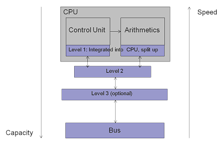
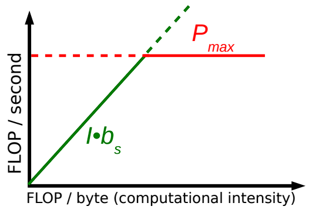

- [1 Motivation: Why do we need efficient code?](#1-motivation-why-do-we-need-efficient-code)
  - [1.1 What do we need?](#11-what-do-we-need)
- [2 Caches: von Neumann bottleneck, cache misses](#2-caches-von-neumann-bottleneck-cache-misses)
  - [2.1 Understanding our code](#21-understanding-our-code)
  - [2.2 Accessing the memory: The Neumann bottleneck](#22-accessing-the-memory-the-neumann-bottleneck)
  - [2.3 Idea of a cache memory](#23-idea-of-a-cache-memory)
  - [2.4 Cache levels](#24-cache-levels)
  - [2.5 Example: Matrix-vector product (1)](#25-example-matrix-vector-product-1)
- [3 Stream benchmark](#3-stream-benchmark)
  - [3.1 Measuring the memory bandwidth](#31-measuring-the-memory-bandwidth)
  - [3.2 Measuring the memory bandwidth](#32-measuring-the-memory-bandwidth)
- [4 Pipelining, out-of-order execution](#4-pipelining-out-of-order-execution)
  - [4.1 Pipelining (1)](#41-pipelining-1)
  - [4.2 Pipelining (2)](#42-pipelining-2)
  - [4.3 Out-of-order execution](#43-out-of-order-execution)
  - [4.4 The Roofline model](#44-the-roofline-model)
  - [4.5 The Roofline model - Example: vector triad](#45-the-roofline-model---example-vector-triad)
  - [4.6 Assumptions behind the Roofline model](#46-assumptions-behind-the-roofline-model)


## 1 Motivation: Why do we need efficient code?

Make it work ✓ → Make it right ✓ → **Make it fast**

Performance is more than not waiting a bit longer:

- Simulations: Better approximations in given time and memory.
- Mobile / embedded / HPC: More efficient energy usage.
- Real-time applications (games, audio): Better experience (more FPS).
- Commercial applications (banking, databases): More transactions per second with the same resources, i.e., lower cost.

Questions:

1. What factors affect the performance?
2. How much (theoretical) performance can a given system achieve?
3. Does our code utilize the potential of the system?
4. What can we do to optimize the performance of our code? (next week)

### 1.1 What do we need?

- Efficient algorithms & data structures that can also be implemented efficiently → See Fundamental Algorithms, Scientific Computing II, Algorithms for SciComp, HPC Alg & Appl, ...
- Understanding of code, instructions, and bottlenecks
- Knowledge of our hardware
- A measure for expected performance

## 2 Caches: von Neumann bottleneck, cache misses

### 2.1 Understanding our code

What happens at machine level for this snippet?

**Our C++ code**

```c
for (auto i = 0; i < size; i++) {
    A[i] = B[i] * C[i];
}
```

**Machine level (simplified)**

```bash
LOAD R1= B[i] 
LOAD R2= C[i] 
MULT R3= B[i]*C[i] 
STORE A[i] = R3 
INCREMENT i 
BRANCH → top if i<size
```

In our programs we want:

- Fast computations [FLOP/s]
    - Minimal operation unit: compute cycle
    - Single-core CPU at 2.0 GHz → 2 · 10^9 cycles/second
    - Multiplication slower than addition, division slower than multiplication
- High memory throughput [GB/s]

### 2.2 Accessing the memory: The Neumann bottleneck

- One or two documents (registers in the ALU) are not sufficient.
- We could introduce more registers (e.g., 32 instead of 16).
- In any case, number of registers is limited.
- Running into the basement is time consuming.
- The faster the CPU, the more annoying the slow search in the memory.

### 2.3 Idea of a cache memory

- Collection of copies of often used documents very close to the office.
- Small and fixed size.
- Several pages come together (cache lines): to get one page, we get the whole volume. Our wish: keep related information next to each other.

### 2.4 Cache levels



Example: 6-core (12-core with SMT) AMD Ryzen 5 laptop processor (Zen 4, January 2023)

- L1: 64 KB per core
- L2: 1 MB per core
- L3: 16 MB shared

Computers have a hierarchy of caches and lots of registers.
- The time of one operation depends on where its data is at the moment.
- It is always whole cache lines that are read, e.g, 8 doubles (64 bytes)
- Goal: spatial and temporal locality.

### 2.5 Example: Matrix-vector product (1)

```c
double A[N][N]; 
double x[N]; 
double y[N];

// y = A x vs. y=A^T x 
for (auto i=0; i<N; i++) {
    y[i]=0.0; 
    for (auto j=0; j<N; j++) {
        y[i] += A[i][j] * x[j];
        // or alternatively:
        // y[i] += A[j][i] * x[j];
    }
}
```

The time to finish one operation depends significantly on where the data is at the moment.

Hands-on: What would you expect from the two variants? Same speed or differences?

- Row- vs. column-major layout (e.g., C++ vs. Fortran)
- Wrong addressing → many cache misses, i.e., latency

Storage schemes play a significant role in performance.

- Avoid (read/write) cache misses!
- Cache miss → waiting for several CPU cycles (longer, the further away from the CPU)

## 3 Stream benchmark

### 3.1 Measuring the memory bandwidth

STREAM: A widespread benchmark to measure the sustainable main memory bandwidth.

Test suites:

- Copy: a(i) = b(i)
- Scale: a(i) = q * a(i)
- Sum: a(i) = b(i) + c(i)
- Triad: a(i) = b(i) + s * c(i)

with large arrays a, b, c.

Designed for large data sets (i.e., much larger than caches) See also performance tools such as [LIKWID](https://github.com/RRZE-HPC/likwid).

### 3.2 Measuring the memory bandwidth

Hands-on: Who of you has the fastest memory?

Tobias’ laptop (2018 Intel Core i7-8565U, 2133MHz LPDDR3):

| Function | Best Rate MB/s | Avg time | Min time | Max time |
| --- | --- | --- | --- | --- |
| Copy | 15359.5 | 0.013574 | 0.010417 | 0.020279 |
| Scale | 12174.8 | 0.016682 | 0.013142 | 0.020152 |
| Add | 16558.6 | 0.020241 | 0.014494 | 0.024192 |
| Triad | 14948.5 | 0.021894 | 0.016055 | 0.026900 |

Makis’ laptop (2019 Intel Core i5-10210U, 2667MHz DDR4):

| Function | Best Rate MB/s | Avg time | Min time | Max time |
| --- | --- | --- | --- | --- |
| Copy | 16861.9 | 0.010088 | 0.009489 | 0.011562 |
| Scale | 16138.9 | 0.010452 | 0.009914 | 0.011706 |
| Add | 18671.1 | 0.013407 | 0.012854 | 0.015403 |
| Triad | 18792.4 | 0.013433 | 0.012771 | 0.014772 |

Try it! (expect some time variance)

**Measuring the memory bandwidth**

To run STREAM:
1. Download STREAM (C variant) from https://www.cs.virginia.edu/stream/FTP/Code/stream.c
2. Build the code: gcc -O stream.c -o stream
3. Run it: ./stream

## 4 Pipelining, out-of-order execution

### 4.1 Pipelining (1)

```c
for (int i=0; i<SIZE; i++)
    A[i] = B[i]*C[i];
```

Assume that multiplication takes 5 steps of 1 cycle each:

1. Separate mantissa/exponent
2. Multiply mantissas
3. Add exponents
4. Normalize result
5. Put correct sign

Different units for each sub-operation → Pipelining concept to speed up computations

### 4.2 Pipelining (2)

- Average execution time per multiplication: ≈ 1 cycle (for large N)
- Aim: Write code in a way that keeps the pipeline full (e.g., avoid branching insideloops).

### 4.3 Out-of-order execution

Assume that we can handle 2 instructions at a time.

Lines 3,4 and 5,6 depend on each other: <br>
→ Sequential instruction handling <br>
→ Loss in performance (1 instruction unit idle)

```c
1 int a, b, c, d;
2 // ...
3 a = c + d;
4 b = a + b;
5 c = d * d;
6 d = d + 2*c;
```

$\downarrow$

```c
3 a = c + d;
4 c = d * d;
5 b = a + b;
6 d = d + 2*c;
```

Out-of-order execution <br>
→ Order of instructions is changed. <br>
→ Only valid if results remain the same!

(this is a technique that the compiler performs for us)

### 4.4 The Roofline model

Two major upper bounds for performance:

1. Applicable peak performance $P_{max}$ [operations / s] <br>(assuming data in L1 cache)
2. Memory throughput.
      - Code characterized by computational intensity $I$ [operations / byte]
      - System-specific applicable peak bandwidth $b_s$ [byte / s]

Expected performance:
$$
P = min(Pmax, I · b_s)
$$



How can we determine Pmax, I, bs?

- Peak performance (hardware-dependent) Pmax
    - Clock speed of CPU
    - Knowledge on pipelining concept and our code <br>
  → how many operations per cycle can we expect?
- Computational intensity (of code) I: use pen and paper <br>
  → count operations per byte in your code.
- Peak bandwidth $b_s$ (hardware-dependent): e.g., STREAM benchmark (or other bandwidth measurements)

### 4.5 The Roofline model - Example: vector triad

```c
double A[size], B[size], C[size], D[size]; 
// ... 
for (auto i=0; i<size; i++) {
    A[i] = B[i] + C[i] * D[i];
}
```

- Theoretical peak performance (single core): <br>
  3 Gcycles/s · 2 FLOP/cycle = 6 GFLOP/s → $P_{max} = 6 GFLOP/s$
- Bandwidth measurement: $b_s = 10 Gbyte/s$
- Computational intensity: I = 2 FLOP / (4 · 8) byte → $I = 0.0625 FLOP/byte$
- Roofline: $P = min(Pmax, bs · I) = bs · I = 0.625 GFLOP/s$<br>
⇒ ≈ 10% of single-core peak performance!

### 4.6 Assumptions behind the Roofline model

**RRZE: “A very short intro to the Roofline model”**

- Data transfer and core execution overlap perfectly: the limit is either only core execution, or only data transfer.
- Latency effects are ignored (perfect streaming mode, i.e., data transfer has already started).
- “Steady-state” code execution (full pipeline)

The Roofline model may be simple, but it is effective: it hides away complexity and helps HPC experts and application scientists communicate.

**And all that we did...**

- ... was considering toy problems
- ... was single-threaded
- ... was single-core

We now know what affects the performance and what performance is theoretically possible in a given system.