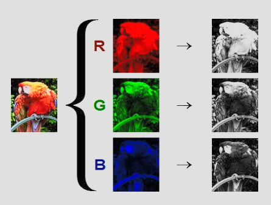
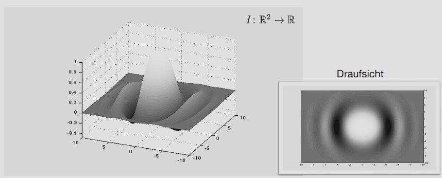

- [1 Darstellung von Bildern](#1-darstellung-von-bildern)
	- [1.1 Von Farbbild zum Intensitätsbild](#11-von-farbbild-zum-intensitätsbild)
	- [1.2 Kontinuierliche und diskrete Darstellung](#12-kontinuierliche-und-diskrete-darstellung)
	- [1.3 Graph einer Funktion](#13-graph-einer-funktion)
	- [1.4 Graph eines Fotos](#14-graph-eines-fotos)
	- [1.5 Diskretes Abtasten](#15-diskretes-abtasten)
	- [1.6 Diskrete Darstellung/Matrixdarstellung](#16-diskrete-darstellungmatrixdarstellung)
	- [1.7 Zusammenfassung](#17-zusammenfassung)
 

## 1 Darstellung von Bildern

### 1.1 Von Farbbild zum Intensitätsbild

- Farbbilder bestehen aus mehreren Kanälen
- In diesem Kurs ausschließlich Graustufenbilder
  - 123



### 1.2 Kontinuierliche und diskrete Darstellung

- **Kontinuierliche** Darstellung als Funktion zweier Veränderlicher (zum Herleiten von Algorithmen) 
  
  $I:\mathbb{R}^2\supset \Omega \to \mathbb R, (x,y)\mapsto I(x,y)$
- Häufige Annahmen
	- $I$ differenzierbar
	- $\Omega$ einfach zusammenhängend und beschränkt
- **Diskrete** Darstellung als Matrix $I\in \mathbb R^{m\times n}$<br>
  Eintrag $I_{k,l}$ entspricht deem Intensitätswert
- Skalierung typischerweise zwischen [0, 255] oder [0, 1]

```
VGA: 480×640 Pixel (ca. 0.3 Megapixel)
HD: 720×1280 Pixel (ca. 1.0 Megapixel)
FHD: 1080×1920 Pixel (ca. 2.1 Megapixel)
```

### 1.3 Graph einer Funktion



### 1.4 Graph eines Fotos


### 1.5 Diskretes Abtasten

- Abtasten eines eindimensionalen Signals
$$
S\\{f(x)\\}=(...,f(x-1),f(x),f(x+1),...)
$$
- Abtasten eines Bildes
$$
S\\{I(x,y)\\}=
\begin{bmatrix}
 \ddots & \vdots & \vdots & \vdots & \\\
 \cdots & I(x-1,y-1) & I(x-1,y) & I(x-1,y+1) & \cdots\\\
 \cdots & I(x,y-1) & I(x,y) & I(x,y+1) & \cdots\\\
 \cdots & I(x+1,y-1) & I(x+1,y) & I(x+1,y+1) & \cdots\\\
  & \vdots & \vdots & \vdots &\ddots
\end{bmatrix}
$$

### 1.6 Diskrete Darstellung/Matrixdarstellung

- Annahme: Ursprung links oben
- Matrixeintrag ist $I_{k,l}=S\\{I(0,0)\\}_{kl}$


### 1.7 Zusammenfassung

- Bilder in Grautönen
- Bilder als Matrizen
- Bilder als glatte Funktionen