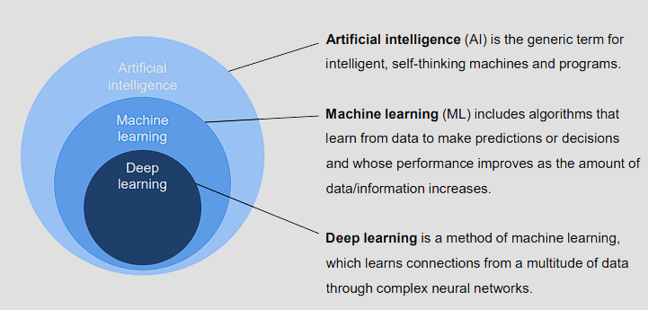
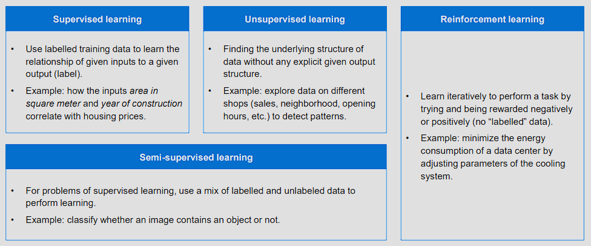

- [1 Introduction](#1-introduction)
- [2 Artificial Intelligence in Production Engineering](#2-artificial-intelligence-in-production-engineering)
  - [Machine Learning on the Different Levels of Production](#machine-learning-on-the-different-levels-of-production)
    - [Example 1 - Job Order Planning for Assembly Lines](#example-1---job-order-planning-for-assembly-lines)
    - [Example 2 - Minimization of Welding Distortions](#example-2---minimization-of-welding-distortions)
- [3 Introduction to the course and to Artificial Intelligence (AI)](#3-introduction-to-the-course-and-to-artificial-intelligence-ai)
  - [3.1 Application fields and opportunities of AI](#31-application-fields-and-opportunities-of-ai)
  - [3.2 What is Artificial Intelligence?](#32-what-is-artificial-intelligence)
- [4 Recommended literature](#4-recommended-literature)

## 1 Introduction

**Definition of the Term Intelligence**

Natural intelligence

**Intelligence** has been defined in many ways: the capacity for logic, understanding, self-awareness, learning, emotional knowledge, reasoning, planning, creativity, critical thinking, and problem-solving. More generally, it can be described as **the ability to perceive or infer information, and to retain it as knowledge to be applied towards adaptive behaviors** within an environment or context. Intelligence is most often studied in humans but has also been observed in both non-human animals and in plants.

The **intelligencer quotient (IQ)** is a **parameter** determined by an intelligence test **to evaluate intellectual performance** in general (general intelligence) or within a certain range (e.g, factors of intelligence) in comparison to a reference group. It always refers to a specific test, since there is no scientifically recognized, unambiguous definition of intelligence. 

**Categorization of Artificial Intelligence, Machine Learning and Deep Learning**

## 2 Artificial Intelligence in Production Engineering

### Machine Learning on the Different Levels of Production

Examples of machine learning at the *[iwb](https://www.mec.ed.tum.de/en/iwb/homepage/)* 

#### Example 1 - Job Order Planning for Assembly Lines 

Solution: genetic algorithm

#### Example 2 - Minimization of Welding Distortions 

Artificial neural networks and evolutionary algorithms 

Initial situation and motivation 

AI-based prediction of the weld depth

Next steps ahead 

## 3 Introduction to the course and to Artificial Intelligence (AI)

| MATH & STATISTICS (Lecture) | DOMAIN KNOWLEDGE (Lecture) |
|---|---|
| understand and remember the basics of machine learning | discuss applications of AI methods in production engineering |
| understand data structures, storage, preparation, features and models | challenges and approaches for the application of KDD1 in the production |
| retrieve, compare and generalize basic methods | discuss and generalize solution concepts for industrial applications |

| PROGRAMMING & DATABASE (Practice) | COMMUNICATION & VISUALIZATION (Group project) |
|---|---|
| apply tools for data analysis purposes and the implementation of models | translate data-driven insights into decisions and actions |
| apply the basic procedure to an exemplary data set | analyze practical problems and derive appropriate steps |
| identify the key challenges and derive appropriate measures to overcome them | design concepts for knowledge acquisition from production/process data |

### 3.1 Application fields and opportunities of AI 

### 3.2 What is Artificial Intelligence?

**Supervised learning** (covered in this course)

- regression
- classification

**Unsupervised learning** (briefly covered in this course)

- clustering
- data compression

**Reinforcement learning** (briefly covered in this course)

- behavior selection
- planning

**Evolutionary learning** (not covered in this course)

- general purpose learning

## 4 Recommended literature

- C.M. Bishop: Pattern recognition and machine learning. New York: Springer, 2006.
- T.Hastie, R. Tibshirani, und J.Friedman: The Elements of Statistical Learning. New York: Springer, 2009.