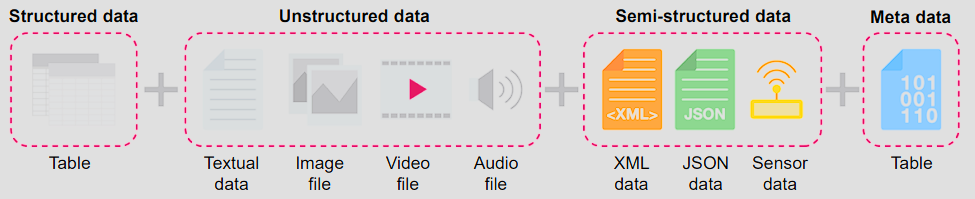
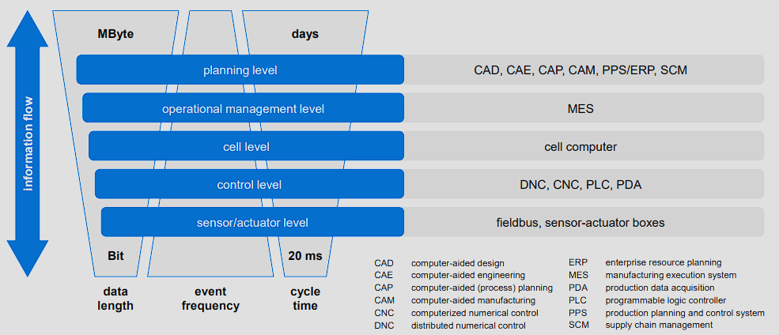
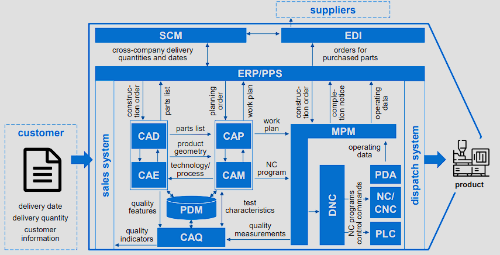
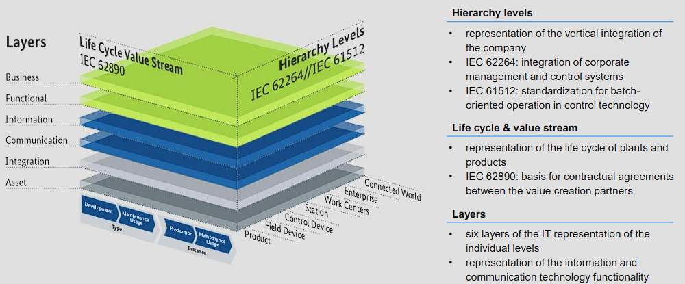
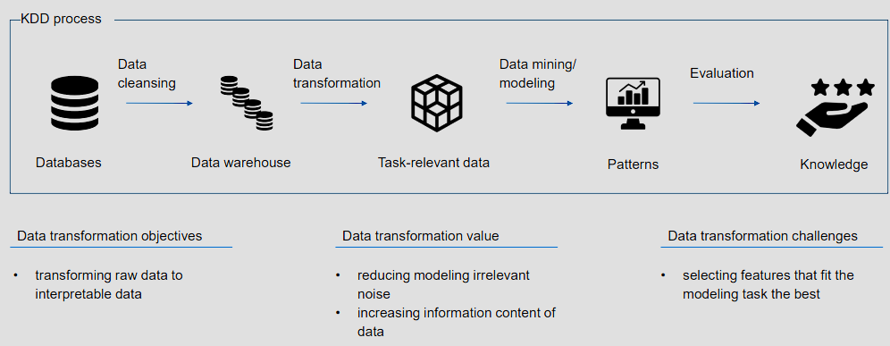

- [1 Learning objectives](#1-learning-objectives)
- [2 Data formats and structure](#2-data-formats-and-structure)
- [3 Data quality](#3-data-quality)
- [4 Data sources](#4-data-sources)
  - [4.1 Architectural model of the computer-integrated production](#41-architectural-model-of-the-computer-integrated-production)
  - [4.2 Information flow](#42-information-flow)
- [5 Summary](#5-summary)

## 1 Learning objectives

**After participating, you will be able to…**

understand different data structures and formats and remember the respective data sources from the production environment.

## 2 Data formats and structure

| Structured data | Unstructured data |
|---|---|
| Adheres to a pre-defined model, that specifies how data can be stored, processed and accessed. | Information that does not have a pre-defined data model or that is nor organized in a pre-defined manner. |
| Straightforward to analyze as data can be aggregated quickly from various locations. | Combination of text with data such as dates, numbers and facts result in irregularities that impede a simple  processing. |
| Examples: Excel files, SQL databases. | Examples: Audio files, video files and No-SQL databases. |

| Semi-structured data | Meta data |
|---|---|
| Form of structured data that does not conform with the formal structure of data models associated with relational databases. | Meta data is technically not a separate form of data structure, but data about data, that provides additional information about a specific set of data. |
| Contains tags or other markers to separate semantic elements and enforce hierarchies of records and fields within the data | Frequently used for initial analyses in big data solutions. |
| Examples: JSON data, XML data | Examples: Location and time of a photograph |

## 3 Data quality

<table>
  <tr>
    <th colspan="4" style="text-align: center;">Data quality</th>
  </tr>
  <tr>
    <th>Intrinsic data quality</th>
    <th>Contextual data quality</th>
    <th>Representational data quality</th>
    <th>Accessibility data quality</th>
  </tr>
  <tr>
    <td>• believability • accuracy • objectivity • reputation 
    </td>
    <td>• value-added • relevancy • timeliness • completeness • appropriate amount of data</td>
    <td>• interpretability • ease of understanding • representational consistency • concise representation</td>
    <td>• accessibility • access security</td>
  </tr>
</table>

## 4 Data sources

### 4.1 Architectural model of the computer-integrated production

### 4.2 Information flow

**Information flow - Reference Architecture Model Industry 4.0 (RAMI 4.0)**

**Information flow - KDD process**

## 5 Summary

**What you might have gathered throughout this lecture**

- the characteristics of different data types and formats
- the dimensions of data quality
- representative models of production processes and architectures
and the allocation of data sources within these models

**After a recap, you should be able to…**

- understand different data structures and formats and
remember the respective data sources from the
production environment.