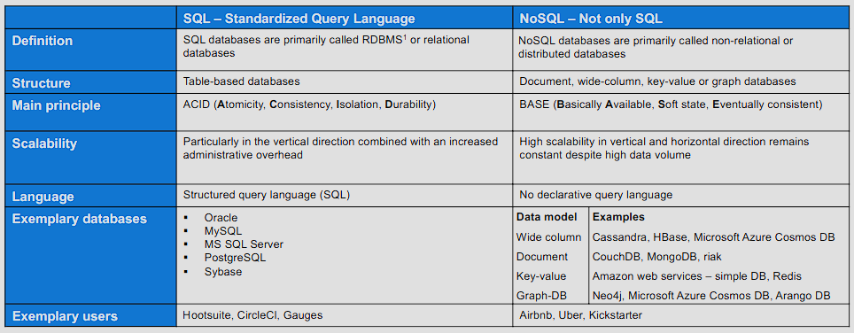

- [1 Knowledge Discovery in Databases (KDD)](#1-knowledge-discovery-in-databases-kdd)
- [2 Learning Objectives](#2-learning-objectives)
- [3 Databases](#3-databases)
  - [3.1 Functionality and Structure](#31-functionality-and-structure)
  - [3.2 Database Types](#32-database-types)
  - [3.3 Relational Databases](#33-relational-databases)
  - [3.4 SQL](#34-sql)
    - [3.4.1 SQL: Data Definition and Manipulation Language](#341-sql-data-definition-and-manipulation-language)
    - [3.4.2 SQL: Data Query Language](#342-sql-data-query-language)
    - [3.4.3 Challenges of Big Data](#343-challenges-of-big-data)
- [4 Data Cleansing](#4-data-cleansing)
  - [4.1 Data Quality](#41-data-quality)
  - [4.2 Workflow of Data Cleansing](#42-workflow-of-data-cleansing)
  - [4.3 Inconsistencies and Duplicates](#43-inconsistencies-and-duplicates)
    - [Inconsistent values](#inconsistent-values)
    - [Duplicate data](#duplicate-data)
  - [4.4 Missing Values](#44-missing-values)
    - [Reasons for missing values](#reasons-for-missing-values)
    - [Issues caused](#issues-caused)
    - [Detecting and exploring missing values](#detecting-and-exploring-missing-values)
    - [Types of missing values](#types-of-missing-values)

## 1 Knowledge Discovery in Databases (KDD)

**Overview**


The data passes through an operational data storage and requires cleansing to ensure the data quality before it is used in the data warehouse for reporting and analysis.

## 2 Learning Objectives

**Databases**

- Understanding how data can be stored in databases and data warehouses
- Understanding the structure of different databases
- Processing of database queries with standardized query language (SQL)

**Data Cleansing**

- Understanding the quality of data in the database
- Getting to know the workflow of data cleansing
- Understanding how data quality issues can be identified
- Getting familiar with the methods of data cleansing

## 3 Databases

Databases manage and access data efficiently.

### 3.1 Functionality and Structure


### 3.2 Database Types




RDBMS are constantly being expanded, e.g. with object-oriented features, and are the most important DBMS.


NoSQL systems gain popularity especially for Big Data applications.


Relational DBMS dominate the market.

### 3.3 Relational Databases


Data is stored, changed, inserted and deleted in tables.

The logical **integrity** of a relational database is defined by the following conditions:

1. Each record in a table has a unique primary key value (entity integrity).
2. For each foreign key in the table T1. there is an identical key value in another table T2, which has been defined when T1 was created (referential integrity).
3. The remaining constraints are fulfilled (domain integrity).

The **primary key** is initially an attribute, or a combination of attributes of a table, that is **unique** for each record of the table.

A **foreign key** is an attribute or an attribute combination of a relation, which refers to a primary key (or key candidate) of another or the same relation.

Data integrity is a term for the assurance of the accuracy and consistency of data over its entire life-cycle.


**Relational representation of entity types**]

```
MEASUREMENTS: {[n_measurements: integer, inv_no: integer, meas_date: integer, ...]}
ROBOTS: {[rob_no: text, robot_type: text, inv_no: integer, SOP: integer, ...]}
ROBOT_BASEDATA: {[manufacturer: text, robot_type: text, a1_gearbox: text, a1_motor: text, ...]}
```

A table can refer to a column of another table by using a foreign key.

### 3.4 SQL

 

**SQL = Structured Query Language**

- Based on relational algebra
- Simple syntax
- Requires independence of the queries from the used DBMS.
- Interfaces to programming languages allow SQL commands to be transferred directly to a database system via a function call (e.g. via ODBC or JDBC).
- Even non-relational database systems are often equipped with an SQL-like interface.

DBMS languages are used to read, update and store data in a database and are specific to a particular data model. The dominant language is SQL.

#### 3.4.1 SQL: Data Definition and Manipulation Language


#### 3.4.2 SQL: Data Query Language


#### 3.4.3 Challenges of Big Data


For Big Data approaches NoSQL applications are often superior to RDBMS. However, for many database problems, the RDBMS remains the first choice.

## 4 Data Cleansing

Data cleansing and data integration usually accounts for 60% and more of the total effort.

### 4.1 Data Quality

Data cleansing can help diminish data quality issues concerning incompleteness and incorrectness. These issues are typically caused by human errors, limitations in measurement devices and flaws in the data collection process.

| Measurement errors | Data collection errors |
|---|---|
| **Discrepancy between the recorded value and the true value** | Apparent where **data objects or attribute values** are **omitted** or data objects are **inappropriately included** |
| Systematic or random | Systematic or random |

Given the high probability of data quality issues in real-life data, effort should be put towards detecting data quality issues and fixing those.

Data is of high quality, if it is suitable for its intended use!

| Timeliness | Relevance | Knowledge about data |
|---|---|---|
| Dataset might only provide a **snapshot** of an ongoing phenomenon: If data is **out of data**, so are developed models and identified patterns. | Available data must contain the **information necessary** for the application. | **Origin** of the data must be known. |
| | Objects in available dataset must be relevant | Information on value **characteriistics**, scale of measurements, type of features and precision must be available. |
| | | Strongly **related attributes / variables** must be identified, since they are likely to provide redundant information. |

Data quality issues bear even higher risks for data analytics projects, as they might not be discovered until all analysis have been performed. This makes domain knowledge even more valuable for such projects.

### 4.2 Workflow of Data Cleansing


### 4.3 Inconsistencies and Duplicates

#### Inconsistent values

<u>Description:</u><br>
Attribute **values might be inconsistent**, e.g. with regard to the permitted **data type, categorical value or range.**

<u>Issue:</u>

- **Influence the outcome of any analysis** and can ultimately lead to incorrect results
- Can **only be identified** if additional or redundant **information is available**

<u>Solution:</u>

1. Create a **data profile** giving insights into the data types, missing values and generate the **summary statistics**
2. Use libraries to **set value constraints** and to check for violation of these constraints

#### Duplicate data

<u>Description:</u><br>
Duplicates are **data objects that are repeated / appear more than once** within a data set.

<u>Issue:</u>

- Lead to a **discrepancy between the occurrence** of data objects with certain characteristics in a dataset compared to the occurrence of such data objects in real life

<u>Sloution:</u>

- **Remove via numerous functions** in different libraries<br>
  $\to$ Attention should be put towards distinguishing real duplicates from **presumed duplicates**

### 4.4 Missing Values

#### Reasons for missing values

- Information was **not collected**
    - Errors in manual data collection
    - Equipment errors
    - Measurement errors
- Attribute / variable **not applicable** to all objects
- **Non-integrable data sources**

#### Issues caused 

- **Loss of efficiency** with regard to handling and analysis of the data
- **Bias** resulting from differences between missing and complete data

#### Detecting and exploring missing values

- **Functions from different programming languages** allow to detect and unify missing values.
- Checking the **dimensions and verifying the data type**
- **Visualization of the distribution** can be beneficial

It is important to assess the relevance of the missing values with regard to their frequency and their significance for further analysis.

#### Types of missing values

**Missing Completely At Random (MCAR)**
  - <u>Definition:</u><br>
  Missing of a value is **neither related to the variable it describes nor any other** variable of the data object.
  - <u>Example:</u><br>
  The sensor recording the regarded value was unavailable for that measurement.

**Missing At Random (MAR)**
  - <u>Definition:</u><br>
  Missing of a value is **not dependent on the variable it describes, but dependent on** values of one or more **other variables** of the data object.
  - <u>Example:</u><br>
  A measurement might not have been taken because another measurement already deemed the product a reject.

**Not Missing At Random (NMAR)**
  - <u>Definition:</u><br>
  Missing of a value is **dependent on its hypothetical value** and/or other variable's values.
  - <u>Example:</u>Elderly women are less likely to submit their age in questionnaires.
  The type of the missing values will influence which approach of handling missing values is feasible. Thus, it is imperative to be familiar with the different types.

