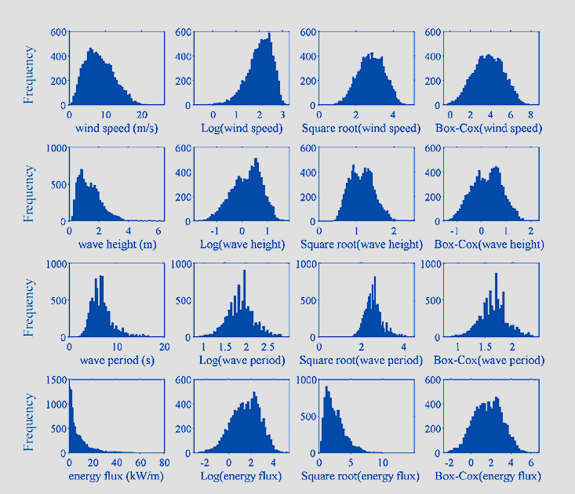

- [1 Knowledge Discovery in Databases (KDD)](#1-knowledge-discovery-in-databases-kdd)
- [2 Learning Objectives](#2-learning-objectives)
- [3 Databases](#3-databases)
	- [3.1 Functionality and Structure](#31-functionality-and-structure)
	- [3.2 Database Types](#32-database-types)
	- [3.3 Relational Databases](#33-relational-databases)
	- [3.4 SQL](#34-sql)
		- [3.4.1 SQL: Data Definition and Manipulation Language](#341-sql-data-definition-and-manipulation-language)
		- [3.4.2 SQL: Data Query Language](#342-sql-data-query-language)
		- [3.4.3 Challenges of Big Data](#343-challenges-of-big-data)
- [4 Data Cleansing](#4-data-cleansing)
	- [4.1 Data Quality](#41-data-quality)
	- [4.2 Workflow of Data Cleansing](#42-workflow-of-data-cleansing)
	- [4.3 Inconsistencies and Duplicates](#43-inconsistencies-and-duplicates)
		- [Inconsistent values](#inconsistent-values)
		- [Duplicate data](#duplicate-data)
	- [4.4 Missing Values](#44-missing-values)
		- [Reasons for missing values](#reasons-for-missing-values)
		- [Issues caused](#issues-caused)
		- [Detecting and exploring missing values](#detecting-and-exploring-missing-values)
		- [Types of missing values](#types-of-missing-values)
	- [4.5 Noise](#45-noise)
		- [Description](#description)
		- [Solution](#solution)
	- [4.6 Outliers](#46-outliers)
		- [Distinction from noise](#distinction-from-noise)
		- [Types of outliers](#types-of-outliers)
		- [Issues caused](#issues-caused-1)
	- [4.7 Normalization](#47-normalization)
		- [Normalization](#normalization)
		- [Standardization](#standardization)
	- [4.8 Transformation](#48-transformation)
		- [Simple Functions](#simple-functions)
		- [Discretization](#discretization)
		- [Binarization](#binarization)
	- [4.9 Highly Correlated Data](#49-highly-correlated-data)
	- [4.10 Dimensionality](#410-dimensionality)
		- [Inconsistent dimensionality](#inconsistent-dimensionality)
		- [High dimensionality](#high-dimensionality)
- [5 Data Warehouse](#5-data-warehouse)

## 1 Knowledge Discovery in Databases (KDD)

**Overview**


The data passes through an operational data storage and requires cleansing to ensure the data quality before it is used in the data warehouse for reporting and analysis.

## 2 Learning Objectives

**Databases**

- Understanding how data can be stored in databases and data warehouses
- Understanding the structure of different databases
- Processing of database queries with standardized query language (SQL)

**Data Cleansing**

- Understanding the quality of data in the database
- Getting to know the workflow of data cleansing
- Understanding how data quality issues can be identified
- Getting familiar with the methods of data cleansing

## 3 Databases

Databases manage and access data efficiently.

### 3.1 Functionality and Structure


### 3.2 Database Types

<table>
  <tr>
	<th></th>
	<th>SQL - Standardized Query Language</th>
	<th colspan="2">NoSQL - Not only SQL</th>
  </tr>
  <tr>
	<th>Definition</th>
	<td>
	  SQL databases are primarily called RDBMS or relational databases
	</td>
	<td colspan="2">
	  NoSQL databases are primarily called non-relational or distributed databases
	</td>
  </tr>
  <tr>
	<th>Structure</th>
	<td>
	  Table-based databases
	</td>
	<td colspan="2">
	  Document, wide-column, key-value or graph databases
	</td>
  </tr>
  <tr>
	<th>Main principle</th>
	<td>
	  ACID (Atomicity, Consistency, Isolation, Durability)
	</td>
	<td colspan="2">
	  BASE (Basically Available, Soft state, Eventually consistent)
	</td>
  </tr>
  <tr>
	<th>Scalability</th>
	<td>
	  Particularity in the vertical direction combined with an increased administrative overhead
	</td>
	<td colspan="2">
	  High scalability in vertical and horizontal direction remains constant despite high data volume
	</td>
  </tr>
  <tr>
	<th>Language</th>
	<td>
	  Structured query language (SQL)
	</td>
	<td colspan="2">
	  No declarative query language
	</td>
  </tr>
  <tr>
	<th>Exemplary databases</th>
	<td>
	  - Oracle<br>
	  - MySQL<br>
	  - MS SQL Server<br>
	  - PostgreSQL<br>
	  - Sybase
	</td>
	<td>
	  <u>Data model:</u><br>
	  - Wide column<br>
	  - Document<br>
	  - Key-value<br>
	  - Graph-DB
	</td>
	<td>
	  <u>Examples:</u><br>
	  - Cassandra, HBase, Microsoft Azure Cosmos DB<br>
	  - Amazon web services - simple DB, Redis<br>
	  - Neo4j, Microsoft Azure Cosmos DB, Arango DB
	</td>
  </tr>
	<th>Exemplary users</th>
	<td>
	  Hootsuite, CircleCI, Gauges
	</td>
	<td colspan="2">
	  Airbnb, Uber, Kickstarter
	</td>
  </tr>
</table>


RDBMS are constantly being expanded, e.g. with object-oriented features, and are the most important DBMS.


NoSQL systems gain popularity especially for Big Data applications.


Relational DBMS dominate the market.

### 3.3 Relational Databases


Data is stored, changed, inserted and deleted in tables.

The logical **integrity** of a relational database is defined by the following conditions:

1. Each record in a table has a unique primary key value (entity integrity).
2. For each foreign key in the table T1. there is an identical key value in another table T2, which has been defined when T1 was created (referential integrity).
3. The remaining constraints are fulfilled (domain integrity).

The **primary key** is initially an attribute, or a combination of attributes of a table, that is **unique** for each record of the table.

A **foreign key** is an attribute or an attribute combination of a relation, which refers to a primary key (or key candidate) of another or the same relation.

Data integrity is a term for the assurance of the accuracy and consistency of data over its entire life-cycle.


**Relational representation of entity types**]

```
MEASUREMENTS: {[n_measurements: integer, inv_no: integer, meas_date: integer, ...]}
ROBOTS: {[rob_no: text, robot_type: text, inv_no: integer, SOP: integer, ...]}
ROBOT_BASEDATA: {[manufacturer: text, robot_type: text, a1_gearbox: text, a1_motor: text, ...]}
```

A table can refer to a column of another table by using a foreign key.

### 3.4 SQL

 

**SQL = Structured Query Language**

- Based on relational algebra
- Simple syntax
- Requires independence of the queries from the used DBMS.
- Interfaces to programming languages allow SQL commands to be transferred directly to a database system via a function call (e.g. via ODBC or JDBC).
- Even non-relational database systems are often equipped with an SQL-like interface.

DBMS languages are used to read, update and store data in a database and are specific to a particular data model. The dominant language is SQL.

#### 3.4.1 SQL: Data Definition and Manipulation Language


#### 3.4.2 SQL: Data Query Language


#### 3.4.3 Challenges of Big Data


For Big Data approaches NoSQL applications are often superior to RDBMS. However, for many database problems, the RDBMS remains the first choice.

## 4 Data Cleansing

Data cleansing and data integration usually accounts for 60% and more of the total effort.

### 4.1 Data Quality

Data cleansing can help diminish data quality issues concerning incompleteness and incorrectness. These issues are typically caused by human errors, limitations in measurement devices and flaws in the data collection process.

| Measurement errors                                            | Data collection errors                                                                                               |
| ------------------------------------------------------------- | -------------------------------------------------------------------------------------------------------------------- |
| **Discrepancy between the recorded value and the true value** | Apparent where **data objects or attribute values** are **omitted** or data objects are **inappropriately included** |
| Systematic or random                                          | Systematic or random                                                                                                 |

Given the high probability of data quality issues in real-life data, effort should be put towards detecting data quality issues and fixing those.

Data is of high quality, if it is suitable for its intended use!

| Timeliness                                                                                                                                       | Relevance                                                                      | Knowledge about data                                                                                                    |
| ------------------------------------------------------------------------------------------------------------------------------------------------ | ------------------------------------------------------------------------------ | ----------------------------------------------------------------------------------------------------------------------- |
| Dataset might only provide a **snapshot** of an ongoing phenomenon: If data is **out of data**, so are developed models and identified patterns. | Available data must contain the **information necessary** for the application. | **Origin** of the data must be known.                                                                                   |
|                                                                                                                                                  | Objects in available dataset must be relevant                                  | Information on value **characteriistics**, scale of measurements, type of features and precision must be available.     |
|                                                                                                                                                  |                                                                                | Strongly **related attributes / variables** must be identified, since they are likely to provide redundant information. |

Data quality issues bear even higher risks for data analytics projects, as they might not be discovered until all analysis have been performed. This makes domain knowledge even more valuable for such projects.

### 4.2 Workflow of Data Cleansing


### 4.3 Inconsistencies and Duplicates

#### Inconsistent values

<u>Description:</u><br>
Attribute **values might be inconsistent**, e.g. with regard to the permitted **data type, categorical value or range.**

<u>Issue:</u>

- **Influence the outcome of any analysis** and can ultimately lead to incorrect results
- Can **only be identified** if additional or redundant **information is available**

<u>Solution:</u>

1. Create a **data profile** giving insights into the data types, missing values and generate the **summary statistics**
2. Use libraries to **set value constraints** and to check for violation of these constraints

#### Duplicate data

<u>Description:</u><br>
Duplicates are **data objects that are repeated / appear more than once** within a data set.

<u>Issue:</u>

- Lead to a **discrepancy between the occurrence** of data objects with certain characteristics in a dataset compared to the occurrence of such data objects in real life

<u>Sloution:</u>

- **Remove via numerous functions** in different libraries<br>
  $\to$ Attention should be put towards distinguishing real duplicates from **presumed duplicates**

### 4.4 Missing Values

#### Reasons for missing values

- Information was **not collected**
  - Errors in manual data collection
  - Equipment errors
  - Measurement errors
- Attribute / variable **not applicable** to all objects
- **Non-integrable data sources**

#### Issues caused

- **Loss of efficiency** with regard to handling and analysis of the data
- **Bias** resulting from differences between missing and complete data

#### Detecting and exploring missing values

- **Functions from different programming languages** allow to detect and unify missing values.
- Checking the **dimensions and verifying the data type**
- **Visualization of the distribution** can be beneficial

It is important to assess the relevance of the missing values with regard to their frequency and their significance for further analysis.

#### Types of missing values

**Missing Completely At Random (MCAR)**

- <u>Definition:</u><br>
  Missing of a value is **neither related to the variable it describes nor any other** variable of the data object.
- <u>Example:</u><br>
  The sensor recording the regarded value was unavailable for that measurement.

**Missing At Random (MAR)**

- <u>Definition:</u><br>
  Missing of a value is **not dependent on the variable it describes, but dependent on** values of one or more **other variables** of the data object.
- <u>Example:</u><br>
  A measurement might not have been taken because another measurement already deemed the product a reject.

**Not Missing At Random (NMAR)**

- <u>Definition:</u><br>
  Missing of a value is **dependent on its hypothetical value** and/or other variable's values.
- <u>Example:</u>Elderly women are less likely to submit their age in questionnaires.
  The type of the missing values will influence which approach of handling missing values is feasible. Thus, it is imperative to be familiar with the different types.


### 4.5 Noise

#### Description

- **Random** component of a measurement error
- **Distortion** of a value or addition of spurious objects
- Typical causes:
  - **Environmental conditions** (e.g. vibrations from other machines)
  - Deployed **sensor** systems

#### Solution

Applying filters to signals decreases the **signal-to-noise-ratio**, but can also decrease the information content.

Solutions for noise in time series:

- Filters
- Averaging (only feasible if time-wise synchronized measurement):
  
  $$
  \\{ \bar{x}_m \\} = \frac{1}{N} \sum _{n=1}^N\\{x_m\\} _k
  $$

Solutions for noise in images:

- Convolution with kernels for
  - Edge detection
  - Sharpening
  - Smoothing

 


### 4.6 Outliers

#### Distinction from noise

- Outliers **can be valid** and hold important information.
  $\to$ e.g. for condition monitoring

#### Types of outliers

- **Data object outliers** differ from the other data objects in the dataset in numerous characteristics.
- **Attribute value outliers** are identified through a comparison against the distribution of the rest of the values for that attribute.

#### Issues caused

- Outliers can **influence the data transformation outcome** and thus lead to **wrong conclusions** in the evaluation step.

There is no precise way to define and identify outliers in general. Instead the raw observations must be interpreted as to whether a value is and outlier or not. Statistical methods can be employed to identify observations.

<u>How to find outliers?</u>

<table>
  <tr>
	<th style="text-align: center;">Visualization</th>
	<td>- Data can be plotted to gain a quick overview of the distribution of data objects.</td>
  </tr>
  <tr>
	<th style="text-align: center;">Statistical approaches</th>
	<td>
	  - Outliers are identified by their probability with regard to a probability distribution model.<br>
	  - Methods: standard deviation method or the interquartile range method (excursus: check Chauvenet's criterion)
	</td>
  </tr>
  <tr>
	<th style="text-align: center;">Proximity-based detection</th>
	<td>
	  - Outliers are identified by their distance from other points.<br>
	  - The k-nearest neighbors are commonly used to measure the distance of objects to each other.
	</td>
  </tr>
  <tr>
	<th style="text-align: center;">Density-based detection</th>
	<td>
	  - Outliers are identified by the density prevailing in the region of an object, the outlier score is the inverse.<br>
	  - Density can be measured by the distance to the k-nearest neighbors or the number of objects within a  predefined radius.
	</td>
  </tr>
  <tr>
	<th style="text-align: center;">Clustering-based detection</th>
	<td>
	  - Outliers are identified by assessing their degree of belonging by measuring the distance to cluster centers.
	  - Alternatively, small clusters can be discarded as outliers.
	</td>
  </tr>
</table>
<br>
<u>And how to solve outliers? And issues?</u>
<table>
  <tr>
	<th>Drop / delete outliers</th>
	<th>Cap outliers (determine a range)</th>
	<th>Impute new calues</th>
	<th>Transform data (e.g. percentiles, square roots, logs</th>
  </tr>
  <tr>
	<td>
	<u>Issues:</u><br>
	  - Loss of potentially valuable data<br>
	  - Reduction of the dataset
	</td>
	<td>
	<u>Issues:</u><br>
	  - Loss of potentially valuable data<br>
	  - Decreased variance of data
	</td>
	<td>
	<u>Issues:</u><br>
	  - Loss of potentially valuable data<br>
	  - Potential intransparency which kind of data was added
	</td>
	<td>
	<u>Issues:</u><br>
	  In the following section.
	</td>

</tr>
</table>

### 4.7 Normalization

#### Normalization

<u>Description:</u>

- **Changes numeric values** of different attributes / variables to a common scale, typically **setting the range between 0-1**

<u>Benefits:</u>

- **Helps preventing variables** with larger ranges to **influence the model more** heavily than those with smaller ranges.

<u>Methods:</u>

- Min-Max-Normalization $\to x_ {new} = \frac{x-x_ {min}}{x_ {max}-x_ {min}}$
- Unit Vector Normalization
- Z-Normalization

#### Standardization

<u>Description:</u>

- Assumes that a **Gaussian distribution** is present
- Sets the **mean of the data to 0** and the standard deviation to 1

<u>Benefits:</u>

- Improves the **numerical stability** of the model and often reduces training time

<u>Methods:</u>

- Z-Normalization (Standardization) $z_ i=\frac{x_ i-\bar x}{s}$

*Normalization is used when trying to model relations between attributes / variables. It reduces the bias that might originate from different scales.*

### 4.8 Transformation

Methods:

#### Simple Functions

<u>Description:</u>

- Some functions can be used to **reduce skewness and variance.**

<u>Methods:</u>

- Logarithm, Square Root, Box Cox

#### Discretization

<u>Description</u>

- Process of **mapping continuous values to discrete values**
- Commonly used for classification

#### Binarization

<u>Description:</u>

- **Maps** a continuous or categorial attribute **onto one or more binary variables** (might increase dimensionality, e.g. one hot encoding)
- Commonly used for association analysis

*Attribute / variable transformation maps an entire set of values of a given attribute / variable to a new set of replacement values. It allows to deal with skewness and allows for more performant computing. All methods lead to a loss of information.*



### 4.9 Highly Correlated Data

Highly correlated data are unlikely to contribute any further information and very likely to cause overfitting. Thus, a correlation coefficient matrix should be calculated to check for possible correlations between attributes / variables.
Overall, domain knowledge helps identifying cases, in which calculation the coefficient is necessary.

**Linear relationships:**

Person's Correlation Coefficient:
$$
r=\frac{cov(x,y)}{\sigma _x \cdot \sigma _y}
$$

- Coefficient returns a value between -1 and 1, i.e. a full negative correlation to a full positive correlation
- Value of 0 means no correlation, whereas an absolute value over 0.5 indicates a notable correaltion

**Non-linear relationships:**

Spearman's Correlation Coefficient:
$$
r=\frac{cov(rank(x),rank(y))}{\sigma _{rank(x)}\cdot \sigma _{rank(y)}}
$$

- Non-Gaussian distribution is no issue (non-parametric correlation)
- Assumes a monotonic relationship
- Rank-based approach quantifies the association between variables **using the ordinal relationship between the values** rather than the specific values

### 4.10 Dimensionality

#### Inconsistent dimensionality

<u>Problem</u>

- Machine learning **algorithms require** training and test **data of consistent dimensions.**
- **Data** from time series and real production applications **might not fulfill this** requirement.

<u>Solution approach</u>

- **Methods** presented to handle **missing values / outliers**
- Methods of the **data transformation** section to unify data dimensionality

#### High dimensionality

<u>The "Curse of Dimensionality":</u>

- Some **data analysis** becomes significantly **harder**
- Data becomes **increasingly sparse** in the space it occupies
- For **classification** there are **not enough objects** to create a model that can predict all classes
- For **clustering** the density and distance are **less meaningful**

## 5 Data Warehouse

**Definition**

A data warehouse (DW) **is a central repository of integrated data optimized for analysis purposes** and combines data from several, usually heterogeneous sources. **Extract-transform-load (ETL) is the main process** to build a data warehouse system.

*The decoupling of a central data warehouse from the databases supplying the data leads on the one hand to a relief of the operative systems and on the other hand opens the option to optimize the analysis-oriented system for the needs of evaluations and reports.*
