- [1 Task Space and Workspace](#1-task-space-and-workspace)
- [2 Modeling Robot as Linked Rigid Bodies](#2-modeling-robot-as-linked-rigid-bodies)
- [3 Rigid Body](#3-rigid-body)
- [4 DoF](#4-dof)
  - [4.1 A Single body](#41-a-single-body)
  - [4.2 For General Robots](#42-for-general-robots)
  - [4.3 DoF and Types of Joints](#43-dof-and-types-of-joints)
- [5 Why Configuration Space?](#5-why-configuration-space)
  - [5.1 Mapping from the workspace to the configuration space](#51-mapping-from-the-workspace-to-the-configuration-space)
  - [5.3 Definitions and examples](#53-definitions-and-examples)
    - [Configuration space:](#configuration-space)
    - [Dimension of configuration space](#dimension-of-configuration-space)
    - [Topology of the configuration space](#topology-of-the-configuration-space)
    - [Example: rigid robot in 2-D workspace](#example-rigid-robot-in-2-d-workspace)
    - [Example: rigid robot in 3-D workspace](#example-rigid-robot-in-3-d-workspace)
    - [Example of a singularity in Euler representation](#example-of-a-singularity-in-euler-representation)
    - [Axis-Angle Representation](#axis-angle-representation)

## 1 Task Space and Workspace

**Task space:** a space where the robot's task can be naturally expressed

**Workspace:** captures the "reachable" space of the end-effector

Both involve some user choice and often are different from C-space.

Examples: 

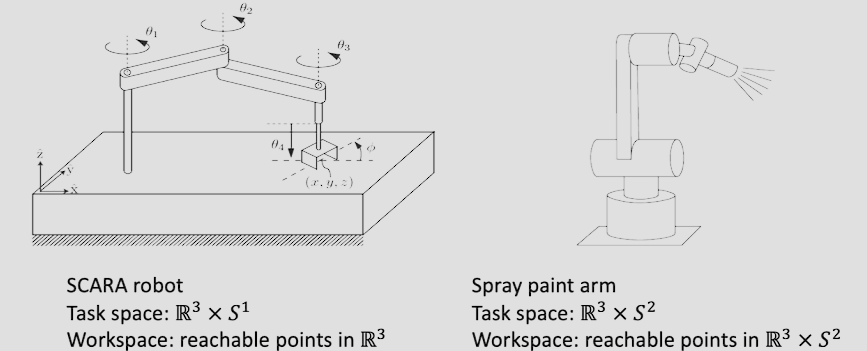

## 2 Modeling Robot as Linked Rigid Bodies

**Common robot models**

- A single point (point robot)
- A single rigid body

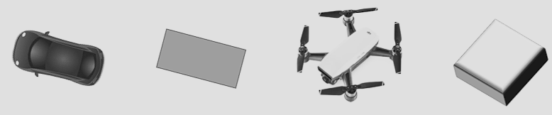

- Multiple rigid bodies (**links**) joined with **joints**

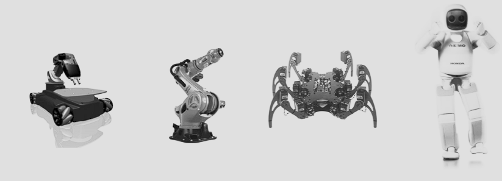

## 3 Rigid Body

To unify notations

- A **rigid body** generally means a one-piece robot
- A **link** is a rigid piece, often a part of a multi-piece robot
- The **links** of a multi-piece robot are joined with **joints (connectors)**
- This course mostly work with a single rigid body

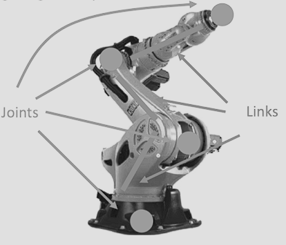

## 4 DoF

### 4.1 A Single body

The position is fully determined by three fixed points on the body

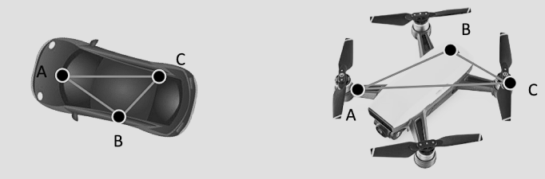

General formula: DoF = total DoF of points - # of constraints

### 4.2 For General Robots

<u>2D chains:</u>

- Base link is 3D ($\mathbb{R} ^2 \times S^1$)
- If fixed, then often 1D
- Adding joints generally adds one more dimension

<u>3D chains:</u>

- Base link is 6D ($\mathbb{R} ^3\times SO(3)$)
- If fixed, depending on the joint
- Then add the DOF of each additional joint

<u>Closed chains:</u>

We have a formula: 
$$
    DOF = N(k-1)- \sum _{i=1}^n (N-f _i)=N(k-n-1)+ \sum _{i=1}^n f _i
$$

- $N$: 6 for 3D, 3 for 2D
- $k$: # of links (including the ground link)
- $n$: the number of joints
- $f_i$: DOF of the joint

### 4.3 DoF and Types of Joints

**Configuration**: specification of where all points of a robot is
**Degrees of freedom** (dof): the smallest number of real-valued (i.e., continuous) coordinates to fully describe configurations of a robot

- 2D
  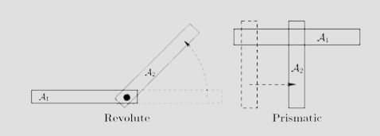

- 3D
- 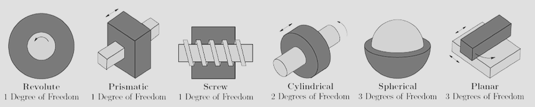

**Motion of the robot is generated by its joints**

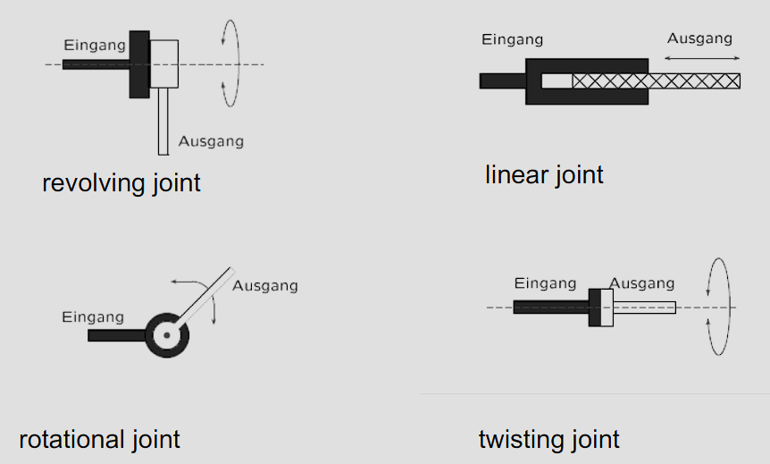

## 5 Why Configuration Space?

A powerful abstraction for solving **motion planning** problems

- Motion planning is to find feasible motions for robots to go from $x_I$ to $x_G$
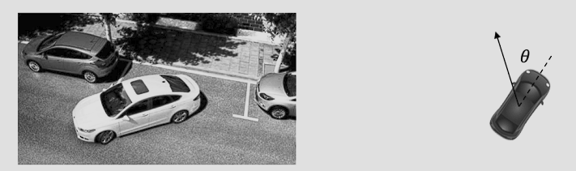
- With $C$-space, this becomes **searching for a path** in the joint space of 2D position $(x,y)\in \mathbb{R}^2$ and rotation $\theta \in S^1$

### 5.1 Mapping from the workspace to the configuration space

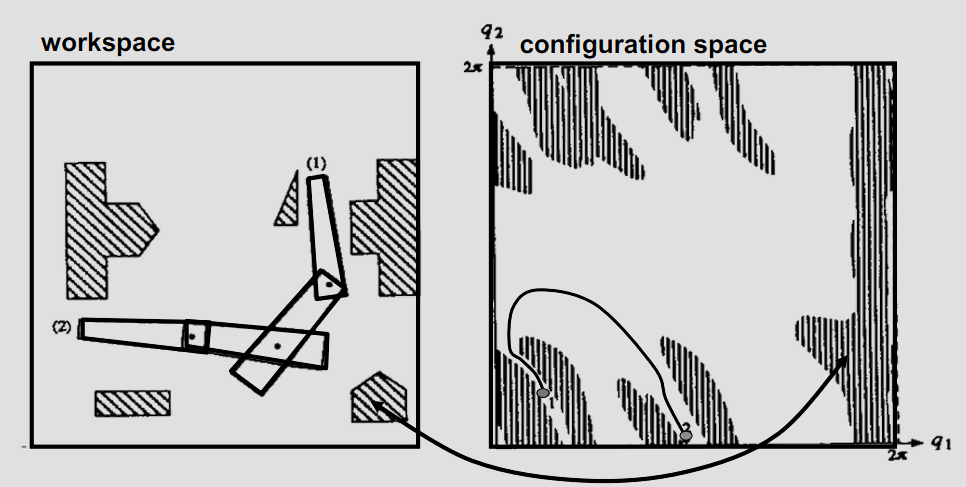

**How do we define a path?**

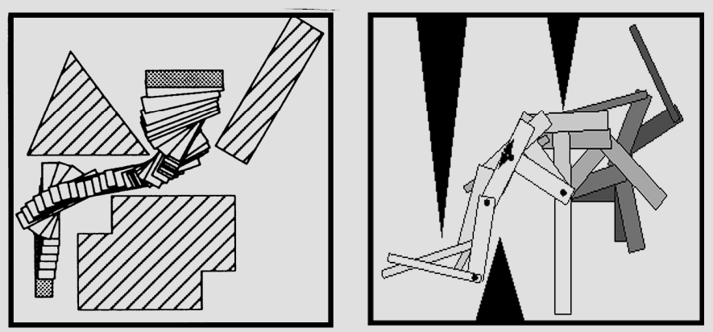

<u>Rough idea:</u>

- Convert rigid robots, articulated robots, etc. into points
- Apply algorithms for moving points

### 5.3 Definitions and examples

#### Configuration space:

The **configuration** of a moving object is a specification of the position of **every** point on the object.

- Usually a configuration is expressed as a vector of position & orientation parameters: $q=(q _1, q _2, ... , q _n)$.

<u>Definition:</u> The **configuration space** $C$ is the set of all possible configurations.

- A configuration is a point in $C$.

#### Dimension of configuration space

- The **dimension of a configuration space** is the **minnimum** number of parameters needed to specify the configuration of the object completely.
- It is also called the **number of degrees of freedom** (dofs) of a moving object.

#### Topology of the configuration space

The topology of $C$ is usuallly **not** that of a Cartesian space $\mathbb{R}^n$

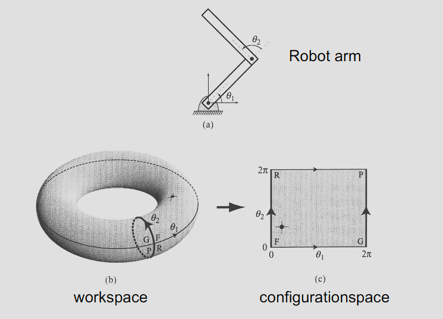

#### Example: rigid robot in 2-D workspace

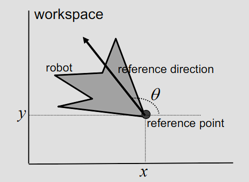

- 3-parameter specification: $q=(x,y,\theta)$ with $\theta \in [0, 2\pi)$. $\to$ 3-D configuration space
- 4-parameter specification: $q=(x,y,u,v)$ with $u^2+v^2=1$. Note $u=\cos \theta$ and $v=\sin \theta$. $\to$ dimension of configuration space = ?? $\to$ **3**
- Topology: a 3_D cylinder $C=\mathbb{R}^2 \times S^1$ 

#### Example: rigid robot in 3-D workspace

- $q=$ (position, orientation) $=(x,y,z, ???)$
- Parametrization of orientations by matrix:
  $q=(r _{11}, r _{12}, ... , r _{32}, r _{33})$ where $r _{11}, r _{12}, ... , r _{33}$ are the elements of rotation matrix
$$
  R=\begin{pmatrix}
 r _{11} & r _{12} & r _{13}\\\
 r _{21} & r _{22} & r _{23}\\\
 r _{31} & r _{32} & r _{33}
\end{pmatrix}
$$
  with
    - $r _{1i}^2 + r _{2i}^2 + r _{3i}^2 = 1$ for all $i$,
    - $r _{1i}r _{1j} + r _{2i}r _{1j} + r _{3i}r _{1j} = 0$ for all $i\ne j$,
    - $det(R)=+1$

- Parametrization of orientations by Euler angles: $(\phi ,\theta ,\psi)$
  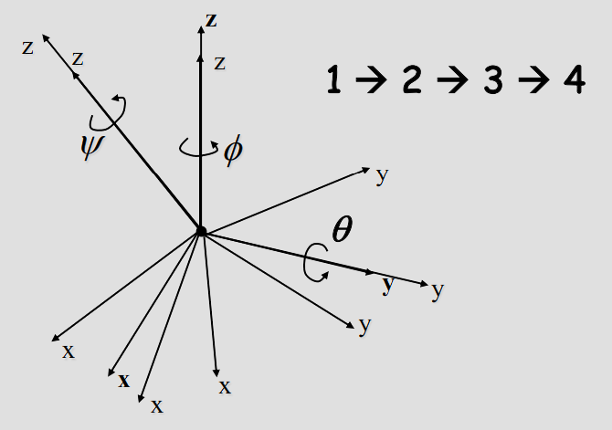

- Parametrization of orientations by **unit quaternion**: $u=(u _1,u _2,u _3,u _4)$ with $u _1^2+u _2^2+u _3^2+u _4^2=1$
    - Note $(u _1, u _2, u _3, u _4)=(\cos \theta /2, n _x\sin \theta /2,n _y\sin \theta /2, n _z\sin \theta /2)$ with $n _x^2+n _y^2+n _z^2=1$.
    - Compare with representation of orientation in 2-D: $(u _1,u _2)=(\cos \theta, \sin \theta)$
    - Advantage of unit quaternion representation
        - Compact
        - No singularity
        - Naturally reflect the topology of the space of orientations
    - Number of dofs = 6
    - Topology: $\mathbb{R}^3\times SO(3)$

#### Example of a singularity in Euler representation

$$
^A_BR _{x,y,z}(\gamma,\beta,\alpha)=R _z(\alpha) R _y(\beta) R _x(\gamma)
=\begin{bmatrix}
 c _\alpha & -s _\alpha & 0\\\
 s _\alpha & c _\alpha & 0\\\
 0 & 0 & 1
\end{bmatrix}
\begin{bmatrix}
 c _\beta &  & s _\beta\\\
 0 & 1 & 0\\\
 -s _\beta & 0 & c _\beta
\end{bmatrix}
\begin{bmatrix}
 1 & 0 & 0\\\
 0 & c _\gamma & -s _\gamma\\\
 0 & s _\gamma & c _\gamma
\end{bmatrix}
$$
$$
=\begin{bmatrix}
 c _\alpha c _\beta & c _\alpha s _\beta s _\gamma - s _\alpha c _\gamma & c _\alpha s _\beta c _\gamma + s _\alpha s _\gamma\\\
 s _\alpha c _\beta & s _\alpha s _\beta s _\gamma + c _\alpha c _\gamma & s _\alpha s _\beta c _\gamma - c _\alpha s _\gamma\\\
 -s _\beta & c _\beta s _\gamma & c _\beta c _\gamma
\end{bmatrix}
$$

$\beta = Atan2(-r _{31},\sqrt {r^2 _{11}+r^2 _{21}}),$ $\alpha = Atan2(r _{21}/c _\beta, r _{11}/c _\beta),$ $\gamma = Atan2(r _{32}/c _\beta, r _{33}/c _\beta)$

$\beta = 90.0^o$, $\alpha = 0.0$,  $\gamma = Atan2(r _{12}, r _{22})$

**Euler representations**
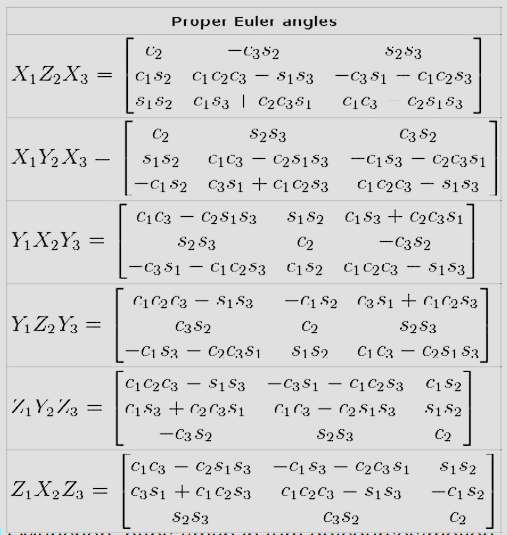

**Rotation matrix**
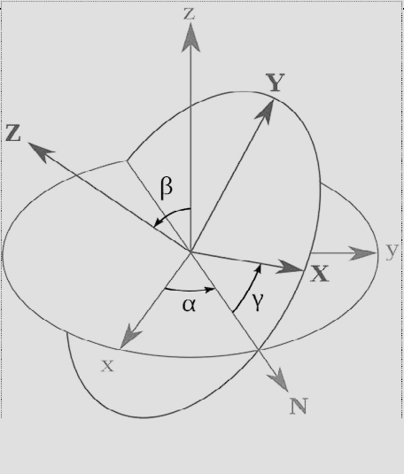

**ATAN2 Function**
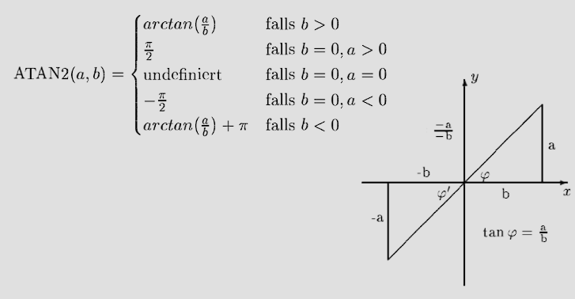

#### Axis-Angle Representation

Let's start from a geometric view point. Imagine a coordinate with a vector $\vec X$ where $\vec k$ is the unit vector representing the axis of ratation. Let the vector $\vec x$ be the result of rotating $\vec X$ by an angle $\theta$ about $\vec k$. You can imagine a circle created by $\vec X$ and $\vec x$ with the axis of rotation going through its center (see Figure 1).

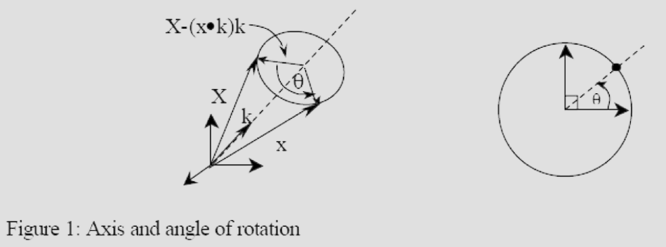

Hence  $\vec x=(\vec X \cdot \vec k)\vec k + (\vec X-(\vec X \cdot \vec k)\vec k)\cos \theta + (\vec k \times \vec X)\sin \theta$ 
(Also a good exercise to prove that $\vec k \times \vec X$ is perpendicular to $\vec X-(\vec X \cdot \vec k)\vec k)$

Let define a skew symmetric matrix $K$ such that $K=J(\vec k)$. This means

$$
K=\begin{bmatrix}
 0 & -k_3 & k_2\\\
 k _3 & 0 & -k_1\\\
 -k_2 & k_1 &0
\end{bmatrix}
$$
and we know that $K\vec v=\vec k\times \vec v$

Now we can write $\vec x$ as
$$
\begin{matrix}
\vec x=\vec X-\vec X+(\vec X \cdot \vec k)\vec k + (\vec X-(\vec X \cdot \vec k)\vec k)\cos \theta + (\vec K \vec X)\sin \theta \\\
=\vec X-(\vec X-(\vec X \cdot \vec k)\vec k) + (\vec X-(\vec X \cdot \vec k)\vec k)\cos \theta + (\vec K \vec X)\sin \theta \\\
=\vec X-(1-\cos \theta)(\vec X-(\vec X \cdot \vec k)\vec k) + (\vec K \vec X)\sin \theta
\end{matrix}\qquad(2)
$$

There exist an identity that $a\times (a\times b)=(a\cdot a)b-(a\cdot b)a$. You can also try to prove this for exercise as well. Now we can rewrite $(\vec X-(\vec X\cdot \vec k)\vec k)$ using this identity as
$$
(\vec X-(\vec X\cdot \vec k)\vec k)=(\vec k\cdot \vec k)\vec X-(\vec X\cdot \vec k)\vec k=\vec k\times(\vec X\times \vec k)=-\vec k\times(\vec k\times \vec X)\qquad(3)
$$

Note here that $(\vec k\cdot \vec k)$ is just 1, so this doesn't change anything. Then rewrite the result using the property of the skew symmetric matrix %K%, we get
$$
-\vec k\times(\vec k\times \vec X)=-\vec k\times K\vec X=-(K(K\vec X))=-K^2\vec X\qquad (4)
$$

Substitute (4) in (2), we get
$$
\begin{matrix}
\vec x=\vec X-(1-\cos \theta)(K^2\vec X)+(K\vec X)\sin \theta \\\
=(I+(1-\cos \theta)K^2+\sin \theta K)\vec X
\end{matrix}\qquad (5)
$$
Since $\vec x=R\vec X$, therefore, the rotation matrix is described by
<table>
    <tr>
        <td>
            $R=(I+(1-\cos \theta)K^2+\sin \theta K)$
        </td>
    </tr>
</table>

$\qquad (6)$

This is **Rodrigues formula**.

Now we can use this formula to find back $\vec k$ and $\theta$.Knowing that $R^T(\vec k, \theta)=R(\vec k, -\theta)$, applying Rodrigues formula for both sides, we will get
$$
\begin{matrix}
R-R^T=2\sin \theta K \\\
K=\frac{R-R^T}{2\sin \theta}
\end{matrix}\qquad (7)
$$
Hence, $\vec =\frac{1}{2\sin \theta}vect(K)$ and $\theta$ can be determined by solving $2\sin \theta = ||vect(R-R^T)||$ (vect是求特征值的意思)

Note: Problems arise when $\theta$ is small since the axis of rotation is ill-definned and that $(\vec k, \theta)$ and $(-\vec k, -\theta)$ result in the same orientation.